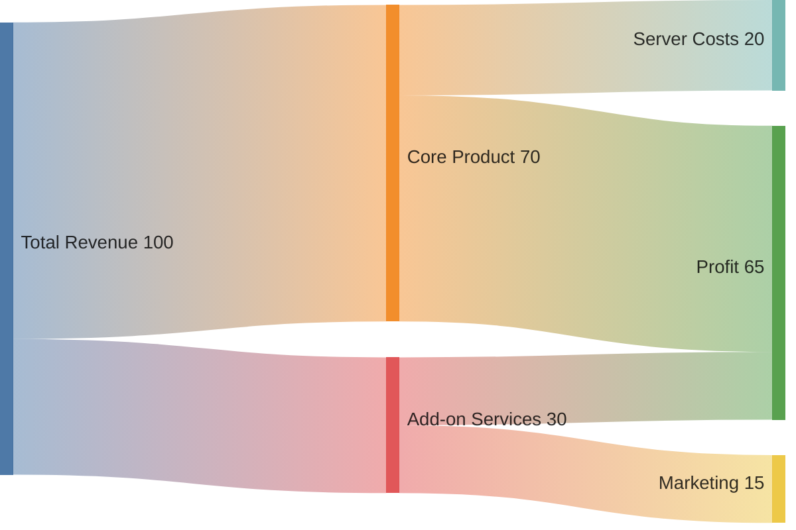

# Sankey Diagram (桑基圖)

- 關鍵字：`sankey-beta`
- 說明：用於展示流量、能量或資金在不同節點間的流向、轉移與損耗分配。

```mermaid
sankey-beta
    Total Revenue,Core Product,70
    Total Revenue,Add-on Services,30
    Core Product,Server Costs,20
    Core Product,Profit,50
    Add-on Services,Marketing,15
    Add-on Services,Profit,15
```
