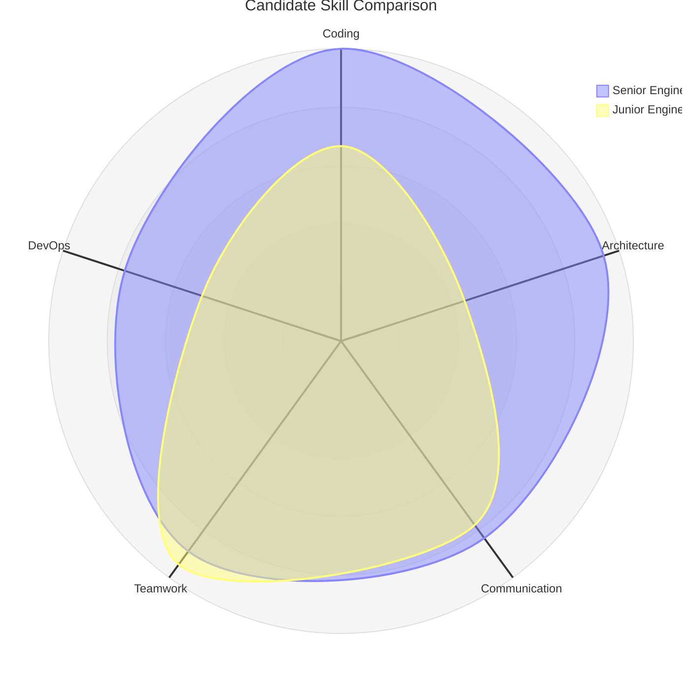

# Radar Chart (雷達圖)

- 關鍵字：`radar-beta`
- 說明：多維度屬性的網狀評估圖，常用於個人技能、產品表現的綜合對比。

```mermaid
radar-beta
    title Candidate Skill Comparison
    axis coding["Coding"], arch["Architecture"], comm["Communication"], team["Teamwork"], devops["DevOps"]
    curve senior["Senior Engineer"]{90, 85, 75, 80, 70}
    curve junior["Junior Engineer"]{60, 40, 70, 85, 45}
```
