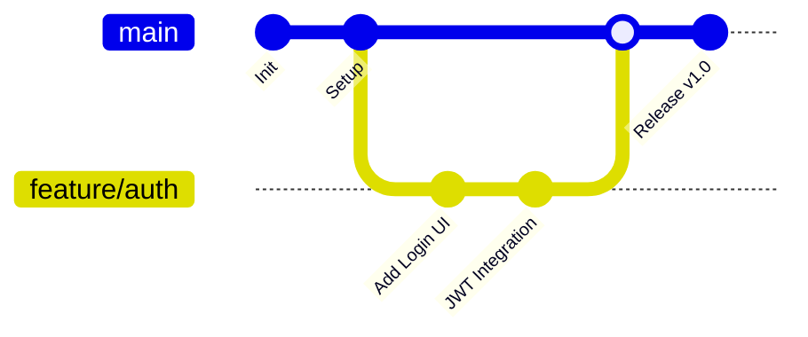

# Git Graph (Git 分支圖)

- 關鍵字：`gitGraph`
- 說明：精準視覺化呈現 Git 倉庫中的 Commit 節點、Branch 分支創立與 Merge 合併軌跡。

```mermaid
gitGraph
    commit id: "Init"
    commit id: "Setup"
    branch feature/auth
    checkout feature/auth
    commit id: "Add Login UI"
    commit id: "JWT Integration"
    checkout main
    merge feature/auth
    commit id: "Release v1.0"
```
