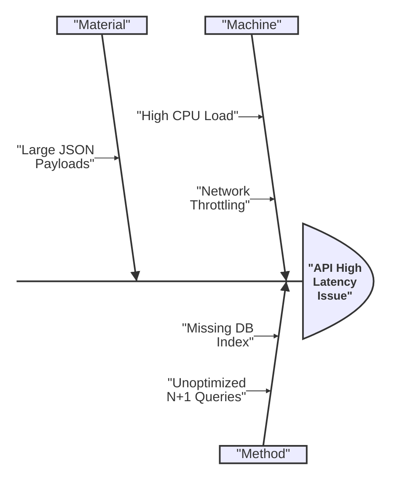

# Ishikawa Diagram (石川圖/魚骨圖)

- 關鍵字：`ishikawa`
- 說明：用於品質管理中的因果關係分析（Cause-and-Effect Analysis），追溯問題的根本原因（Root Cause）。

```mermaid
ishikawa
  "API High Latency Issue"
    "Machine"
      "High CPU Load"
      "Network Throttling"
    "Method"
      "Missing DB Index"
      "Unoptimized N+1 Queries"
    "Material"
      "Large JSON Payloads"
```
