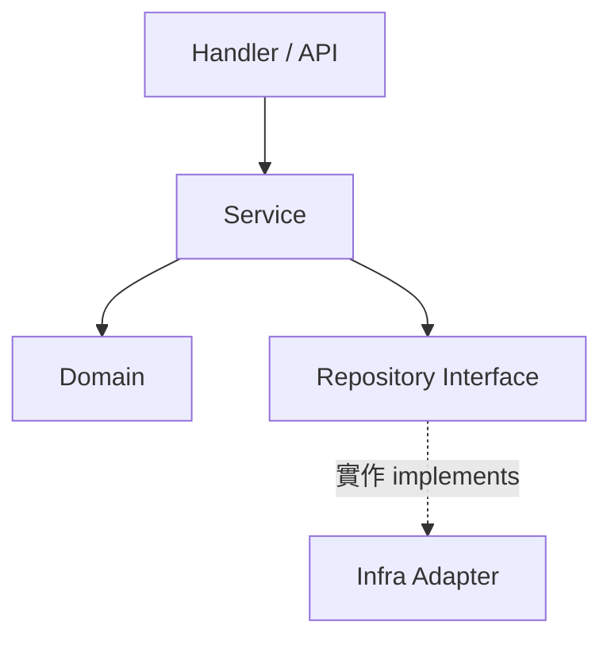

# system-planner

一次規劃 `一個 feature` 的系統架構：它放在整體架構的哪一層、邊界與介面長什麼樣、資料怎麼流，並確保整體架構保持 `清晰 (clear)` 且 `高度可擴充 (highly scalable)`。

> `Planning Only`：只產出計畫，不實作、不重構、不修改任何程式碼或設定。
> 唯一寫入：`<workspace>/plans/architecture-<feature_name>.md` 與 `<workspace>/README.todo`。

## 分工 (Division of Labor)

| 技能 (Skill)       | 角色 (Role)                              |
| ------------------ | ---------------------------------------- |
| `project-explore`  | 產出 README/CLAUDE.md 完整現況文件       |
| `business-planner` | 規劃一個 feature 的商業價值              |
| `system-planner`   | 規劃一個 feature 的系統架構 — 本技能     |

## 執行守則 (Execution Rules)

依序照做，不需要額外判斷：

1. 一次只規劃 `一個 feature`。使用者一次給多個時：只取第一個，
   其餘各以一行 `- [ ] architecture-<name>: pending` 記入 `README.todo`。
2. 資訊不足時不要中斷：採用最簡單的假設，寫入報告的
   `風險與假設 (Risks & Assumptions)` 章節。
3. 掃描上限：最多 Read `15` 個檔案。排除 `.git`, `node_modules`,
   `vendor`, `dist` 與產生碼。
4. 有既有慣例就跟慣例（分層、命名、目錄），不新造分層、不引入新框架。

## 執行步驟 (Procedure)

### Step 1 — 界定 feature (Define the Feature)

1. 決定 `<feature_name>`：kebab-case，取自使用者需求的核心名詞。
2. 寫一句話目標：`誰` 用它 `做什麼`。
3. 列 2~3 條 `不做什麼 (out of scope)`。

產出：feature 名稱、一句話目標、範圍界線。

### Step 2 — 盤點現況架構 (Current Architecture Scan)

| 要找的東西 (Target)   | 方法 (How)                                        |
| :-------------------- | :------------------------------------------------ |
| 頂層結構              | Glob 兩層目錄樹                                   |
| 進入點 (Entry Points) | 找 `main` / `cmd` / `routes` / `handler`          |
| 相關既有模組          | Grep feature 關鍵字與同義詞                       |
| 高改動熱點            | `git log --since=6.month --name-only` 統計次數    |

產出：現況架構圖（Mermaid flowchart，節點 ≤ 10）+ 相關模組清單。

### Step 3 — 架構位置與邊界 (Placement & Boundaries)

1. 依專案既有分層放置該 feature（如 `Handler` / `Service` / `Domain` /
   `Repository`）；寫一段話說明放哪裡、為什麼。
2. 明訂依賴方向：只能由外層指向內層 (Dependency Inversion)。
3. 定義邊界：這個 feature `擁有` 哪些資料與邏輯、`不碰` 哪些既有模組。

產出：位置說明一段話 + 邊界清單。

### Step 4 — 介面與資料流 (Interfaces & Data Flow)

1. 為每個跨模組互動定義 `介面 (Interface / API Contract)`：
   名稱、輸入、輸出、錯誤情況，一行一個列成表格。
2. 介面數 ≤ 5；超過表示切太細，先合併再繼續。
3. 用 Mermaid 畫資料流：



產出：介面表 + 資料流圖。

### Step 5 — 清晰與可擴充性檢查 (Clarity & Scalability Check)

逐項回答 `是` / `否` / `不適用`，每項附一句理由：

1. 單一職責：新模組只有一個變更理由？
2. 依賴方向：沒有內層指向外層？沒有循環相依？
3. 可替換：外部依賴（DB、第三方服務）都隔在介面後？
4. 水平擴充：無狀態、可多實例部署？
5. 擴充點：下一個同類 feature 可以不改核心就加入？

任一項為 `否` → 回 Step 3/4 修正設計；最多修正 `2` 輪，
仍為 `否` 的項目寫入 `風險與假設`。

產出：檢查表結果。

### Step 6 — 漸進落地步驟 (Incremental Steps)

拆成 `3~7` 步，每步一列，可獨立交付與回滾：

| 步驟 (Step) | 做什麼 (What) | 驗證 (Verify) | 回滾 (Rollback) |
| :---------- | :------------ | :------------ | :-------------- |

產出：落地步驟表。

### Step 7 — 撰寫計畫 (Write Plan)

1. `mkdir -p plans`，寫入 `<workspace>/plans/architecture-<feature_name>.md`。
2. 在 `<workspace>/README.todo` 追加一行：
   `- [ ] architecture-<feature_name>: <一句話目標>`。

報告結構（每章填入對應 Step 的產出）：

```markdown
# 架構計畫 — <feature_name> (Architecture Plan)

## 1. 目標與範圍 (Goal & Scope)
<!-- Step 1：一句話目標 + out of scope -->

## 2. 現況架構 (Current Architecture)
<!-- Step 2：架構圖 + 相關模組清單 -->

## 3. 架構位置與邊界 (Placement & Boundaries)
<!-- Step 3：位置說明 + 邊界清單 -->

## 4. 介面與資料流 (Interfaces & Data Flow)
<!-- Step 4：介面表 + 資料流圖 -->

## 5. 清晰與可擴充性檢查 (Clarity & Scalability Check)
<!-- Step 5：檢查表結果 -->

## 6. 漸進落地步驟 (Incremental Steps)
<!-- Step 6：落地步驟表 -->

## 7. 風險與假設 (Risks & Assumptions)
<!-- 執行中所有假設與未解決的「否」項 -->
```

## 規則 (Rules)

- `僅規劃`：只產出計畫；唯一輸出是 `plans/` 報告與 `README.todo` 一行。
- 章節標題用繁體中文加英文括號；術語附英文與圓括號。
- 不使用粗體語法，一律以 `backtick` 強調。
- 圖表一律 Mermaid；邊線文字 (edge text) 必須用雙引號包覆。
- 簡化優先：`移除` 優於 `新增抽象`；擴充點少於 2 個時不做插件化。

## 常見錯誤 (Common Mistakes)

| 錯誤 (Mistake)             | 修正 (Fix)                             |
| -------------------------- | -------------------------------------- |
| 一次規劃多個 feature       | 只取第一個，其餘記入 `README.todo`     |
| 新造分層或引入新框架       | 跟隨專案既有慣例                       |
| 介面切太細                 | 介面數 ≤ 5，超過先合併                 |
| 只畫新架構，缺落地路徑     | 必附 3~7 步可回滾的落地步驟表          |
| 資訊不足就停下來反問       | 用最簡假設繼續，記入風險與假設         |

## 完成前自檢 (Final Checklist)

- [ ] 只規劃了一個 feature
- [ ] 檔案位於 `plans/architecture-<feature_name>.md`
- [ ] 每個介面都有輸入 / 輸出 / 錯誤
- [ ] 每個落地步驟都有驗證與回滾方式
- [ ] 沒有粗體；Mermaid 邊線文字有雙引號
- [ ] `README.todo` 已追加一行
