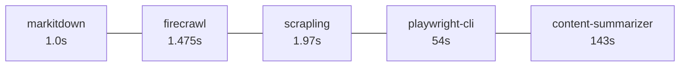

# 探索插件 (Explore Plugin)

`explore` 插件整合 4 個 `抓取`、`爬蟲` 與 `內容摘要` 技能（用於從網頁、檔案、影片等來源擷取並整理內容），加上 `project-explore` 技能做完整 workspace onboarding 與業務萃取。

## 技能清單 (Skills)

### 抓取 / 摘要類 (Fetch & Summarize)

| 技能                 | 工具                          | 路徑                          |
| -------------------- | ----------------------------- | ----------------------------- |
| `content-summarizer` | workflow（底層 `markitdown`） | `./skills/content-summarizer` |
| `firecrawl`          | `firecrawl` CLI（雲端）       | `./skills/firecrawl`          |
| `markitdown`         | `markitdown` Python CLI       | `./skills/markitdown`         |
| `playwright-cli`     | `playwright-cli` 瀏覽器自動化 | `./skills/playwright-cli`     |
| `scrapling`          | `scrapling` Python 框架       | `./skills/scrapling`          |
| `summarize.sh`       | `summarize` CLI               | `./skills/summarize.sh`       |

### Onboarding & 業務萃取 (Onboarding & Business)

| 技能              | 用途                                                       | 路徑                         |
| ----------------- | ---------------------------------------------------------- | ---------------------------- |
| `project-explore` | Workspace 全掃描 → `README.md` + `CLAUDE.md` + `README.business.md` + symlinks（合併自 `project-explore` + `business-extract`） | `./skills/project-explore` |
| `project-route`   | 將任意檔案路徑映射到所屬專案                                  | `./skills/project-route`     |

## 技能比較 (Skill Comparison)

> 測試標的 (URL)：`https://platform.claude.com/docs/en/build-with-claude/prompt-engineering/claude-prompting-best-practices`
> 測試日期：2026-06-07

### 結論 (TL;DR)

| 面向             | 推薦                                                                 | 原因                             |
| ---------------- | -------------------------------------------------------------------- | -------------------------------- |
| 速度             | `markitdown`                                                         | `1.0s` 純 HTTP                   |
| 內容乾淨度       | `markitdown` / `content-summarizer`                                  | 已自動裁切 nav/footer            |
| 主文完整度       | `markitdown`                                                         | 結尾 mid-code-block 表示完整下載 |
| `JS` 渲染 / 反爬 | `playwright-cli`                                                     | 唯一真瀏覽器                     |
| 附加價值         | `content-summarizer`                                                 | `TL;DR` + 6 要點 + 3 商業提案    |
| 無需 API key     | `markitdown` / `scrapling` / `playwright-cli` / `content-summarizer` | 完全本地執行                     |

### 完整比較表 (Detailed Comparison)

| 技能                 | 工具/版本                | 耗時     | 字元數   | 詞數    | 主文含側欄 | 設定需求                                        |
| -------------------- | ------------------------ | -------- | -------- | ------- | ---------- | ----------------------------------------------- |
| `markitdown`         | `markitdown 0.1.6`       | `1.0s`   | `62,064` | `8,739` | ✗ 乾淨     | `pip install markitdown[all]`                   |
| `scrapling`          | `scrapling 0.4.8` (HTTP) | `1.97s`  | `64,239` | `8,510` | ⚠ 部分     | `pip install scrapling browserforge playwright` |
| `firecrawl`          | `firecrawl v1.18.0`      | `1.475s` | `70,488` | `8,552` | ⚠ 大量     | `FIRECRAWL_API_KEY` 或 stored credentials       |
| `playwright-cli`     | `playwright-cli 0.1.13`  | `54s`    | `56,132` | `7,595` | ✓ 完整     | 瀏覽器已安裝                                    |
| `content-summarizer` | workflow                 | `143s`   | `67,566` | `9,517` | ✗ 乾淨     | LLM provider（用於摘要）                        |
| `summarize.sh`       | `summarize` CLI          | —        | —        | —       | —          | ❌ LLM provider + prompt config                 |

### 速度階梯 (Speed Ladder)



### 內容品質觀察 (Content Quality)

- `markitdown`：H1 起頭、code block 收尾，nav 殘留為零
- `content-summarizer`：同 `markitdown` 內容 + 結構化摘要與商業提案
- `scrapling`：首段含 `Loading...` 殘字、nav 為行內列表
- `firecrawl`：首段含整個 `Claude API Docs Home` nav、結尾含 `### Terms and policies` 頁尾
- `playwright-cli`：內容正確但 `eval document.body.innerText` 回傳的 JSON 字串內 `\n` 是字面跳脫

## 選用指引 (When to Use)

| 情境                              | 推薦                               |
| --------------------------------- | ---------------------------------- |
| 純粹抓文檔頁 markdown             | `markitdown`                       |
| 需要 `JS` 渲染或繞過反爬          | `playwright-cli`                   |
| 需要乾淨 HTTP 抓取 + 自訂轉檔     | `scrapling`                        |
| 已訂閱 `firecrawl`、要雲端託管    | `firecrawl`                        |
| 要「重點 + 行動提案」一站完成     | `content-summarizer`               |
| 想用 LLM 重寫為摘要、不需本地 LLM | `summarize.sh`（需先設定 API key） |

## 跳過的技能 (Skipped Skills)

- `summarize.sh`：設定檔 `~/.summarize/config.json` 缺 `prompt` 且所有 `apiKeys` 為空，本地 Ollama 也未運行 → `Invalid config file ... "prompt" must not be empty.` 停止
- `firecrawl`：原本擔心缺 `FIRECRAWL_API_KEY`，但 `firecrawl --status` 確認已認證（`998/1000` credits）→ 改為派代理成功

## 測試輸出 (Test Artifacts)

```text
/tmp/skill-comparison/
├── markitdown.md           62,064 B   8,739 w   904 L
├── scrapling.md            64,239 B   8,510 w
├── firecrawl.md            70,488 B   8,552 w   997 L
├── playwright-cli.md       56,132 B   7,595 w
├── content-summarizer.md   67,566 B   9,517 w
└── fetch_scrapling.py
```

## AI 基準測試 (AI Benchmark)

完整的一步一步基準測試指南（含設定方式與 2026-06-19 結果）位於：

- `plugins/explore/references/benchmark.md` — step-by-step setup guide, credential configuration, and timed benchmark results for all 6 skills against `https://github.com/trending`

### 快速基準 (Quick Recap — 2026-06-19 v2)

| 技能 (Skill) | 耗時 (Time) | 主要內容 (Major) | 次要內容 (Minor) | JS/CSS | 範例輸出 (Sample) |
|:---|:---:|:---:|:---:|:---:|:---:|
| `firecrawl` | 1.1s | 5.3 KB | 0 | ✗ | `trending-major.md` |
| `markitdown` | 1.2s | 5.4 KB | 345 lines | ✗ | `trending-major.md` |
| `scrapling` | 1.9s | 13.2 KB | 0 | ✗ | `trending-cards.md` |
| `content-summarizer` | 4s | 12.6 KB | 345 lines | ✗ | `summary.md` |
| `summarize.sh` | 18s | 5.8 KB | 0 | ✗ | `summary.md` |
| `playwright-cli` | 126s | 15.8 KB (JSON) | 0 | ✗ | `trending.json` |

> 所有樣例輸出檔案位於 `/tmp/skill-test-v2-<skill>/` 目錄下。詳見 `references/benchmark.md` 的 Step 4-5 指令與 Step 7 完整結果。

## 技能 AI 憑證需求 (Skill AI Credential Requirements)

| 技能 (Skill) | 需要 API 金鑰？ | 如何設定 |
|:---|:---:|:---|
| `content-summarizer` | 隱含 (AI session) | 不需要獨立設定;由父 AI session 的 LLM 進行摘要 |
| `firecrawl` | 可選 (guest tier 可用) | `export FIRECRAWL_API_KEY=fc-...` 或 `firecrawl init --browser` |
| `markitdown` | 不需要 | — |
| `playwright-cli` | 不需要 | — |
| `scrapling` | 不需要 | — (Cloudflare bypass 自動處理,不需要 API key) |
| `summarize.sh` | 必須 | `~/.summarize/config.json` — 填入 `apiKeys`, `prompt`, provider `baseUrl` |

> 詳細設定範例（含 `~/.summarize/config.json` 最小可用範本）請參見 `references/benchmark.md` Step 2。

## 相關連結 (See Also)

- 插件清單：`plugins/explore/.claude-plugin/plugin.json`
- 技能註冊表：`skills.json`
- 基準測試指南：`plugins/explore/references/benchmark.md`
- 測試樣例輸出：`ls /tmp/skill-test-v2-*`
