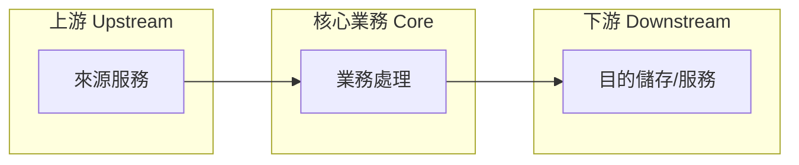

# project-explore

兩種模式，按觸發詞自動選擇：

| 模式 | 觸發情境 | 產出 |
| --- | --- | --- |
| `A. Workspace Scan` | 「explore project」「summarize codebase」等探索整個 workspace | `README.md` + `CLAUDE.md` + `README.business.md` + symlinks |
| `B. Business-only` | 「extract business」「業務萃取」「業務價值」「上下游分析」等純業務請求 | 僅 `README.business.md` |

兩模式共用 Step 8（業務萃取八個章節）；模式 A 多出 README/CLAUDE.md 撰寫與 symlink 建立步驟。

## Overview

`Mode A` 一次掃描整個 workspace，產出三份正典文件 + 兩個跨 Agent 符號連結：

| File | 焦點 |
| --- | --- |
| `README.md` | `功能性需求 (Functional Requirements)`：業務領域、領域流程、實體、使用情境 |
| `CLAUDE.md` | `非功能性需求 (Non-functional Requirements)`：專案結構、技術棧、建置/部署、慣例 |
| `README.business.md` | 純業務價值萃取：上下游、常見操作、狀態/流程、約束、風險、核心/非核心 |

### Design Philosophy

一個專案可能有幾十個 handler / service / module，但它們只屬於少數幾個
`業務領域 (Business Domains)`。README 應該以領域為單位組織，不是以檔案或
handler 為單位。

`Example:` 一個資料服務有 20+ 個 handler，但只屬於約 4 個領域：

- `資料複製 (Data Replication)` — 跨區純資料同步
- `用戶遷移 (User Migration)` — 用戶區域切換工作流
- `資料修復 (Data Fix)` — 臨時資料修正工具
- `稽核日誌 (Audit Log)` — 追蹤與合規

README 把這些按領域分組並描述流程，而不是列出每個 handler。

## When to Use

- 專案沒有 `README.md` 或 `CLAUDE.md`
- 現有文件在大改動後過期
- 接手陌生 codebase
- 大型重構或遷移之後
- 使用者明確要求萃取任何輸入（folder / repo / 檔案 / 文件 / 純文字）的業務價值
- 使用者要求「業務上下游」「風險評估」「核心 vs 非核心」分析

## Procedure

### Mode A — Workspace Scan

#### Step 1 — Discover project layout

使用 `Glob` 工具探索檔案。套用以下排除模式：

```
Excluded directories and files:
  .git, .svn, .hg, .DS_Store, Thumbs.db
  archive/, *.bak*
  .geminiignore, .gitlab, .pre-commit-config.yaml
  *.code-workspace, .golangci.yml, go.sum
  .specify, .gemini, .agent, .serena, .ttadk, .coco
  .devops, .settings
  .classpath, .project
  target/, out/, dist/, output/
  .mvn/, node_modules/, __pycache__/, .venv/
  __debug_bin*
  gen/**, kitex_gen/**, thrift_gen/**
  .playwright-mcp
  .vscode/, .claude/
```

```bash
# Step 1a: top-level structure
Glob("*", maxDepth=1)

# Step 1b: deeper structure (exclude noise)
Glob("**/*", maxDepth=5, exclude=[
  "**/.git/**", "**/.svn/**", "**/.hg/**",
  "**/.DS_Store", "**/Thumbs.db",
  "**/archive/**", "**/*.bak*",
  "**/.geminiignore", "**/.gitlab/**",
  "**/.pre-commit-config.yaml",
  "**/*.code-workspace", "**/.golangci.yml", "**/go.sum",
  "**/.specify/**", "**/.gemini/**", "**/.agent/**",
  "**/.serena/**", "**/.ttadk/**", "**/.coco/**",
  "**/.devops/**", "**/.settings/**",
  "**/.classpath", "**/.project",
  "**/target/**", "**/out/**", "**/dist/**", "**/output/**",
  "**/.mvn/**", "**/node_modules/**",
  "**/__pycache__/**", "**/.venv/**",
  "**/__debug_bin*",
  "**/gen/**", "**/kitex_gen/**", "**/thrift_gen/**",
  "**/.playwright-mcp/**"
])
```

若無 `Glob` 工具，fall back 到 bash：

```bash
find . -maxdepth 3 -type f \
  -not -path '*/.git/*' -not -path '*/.svn/*' -not -path '*/.hg/*' \
  -not -name '.DS_Store' -not -name 'Thumbs.db' \
  -not -path '*/archive/*' -not -name '*.bak*' \
  -not -path '*/.gemini/*' -not -path '*/.agent/*' \
  -not -path '*/.serena/*' -not -path '*/.ttadk/*' -not -path '*/.coco/*' \
  -not -path '*/.specify/*' -not -path '*/.gitlab/*' \
  -not -path '*/.devops/*' -not -path '*/.settings/*' \
  -not -path '*/target/*' -not -path '*/out/*' \
  -not -path '*/dist/*' -not -path '*/output/*' \
  -not -path '*/.mvn/*' -not -path '*/node_modules/*' \
  -not -path '*/__pycache__/*' -not -path '*/.venv/*' \
  -not -name '__debug_bin*' \
  -not -path '*/gen/*' -not -path '*/kitex_gen/*' -not -path '*/thrift_gen/*' \
  -not -path '*/.playwright-mcp/*' \
  -not -name '*.code-workspace' -not -name '.golangci.yml' -not -name 'go.sum' \
  | sort | head -200
```

#### Step 2 — Identify key files

依序讀取下列檔案（若存在）：

1. `package.json` / `go.mod` / `pyproject.toml` / `Cargo.toml` — 語言與依賴
2. `Makefile` / `Dockerfile` / `docker-compose.yml` — 建置與啟動
3. `*.config.*` / `.env.example` — 設定形狀
4. Entry points: `main.*`, `index.*`, `app.*`, `cmd/`
5. 現有 `README.md` 與 `CLAUDE.md` — 保留仍有效的部分

#### Step 3 — Read critical source files

skim 前 5-10 個最重要的原始檔以理解：

- 核心 domain models / types
- 主要 entry point 邏輯
- API routes 或 CLI commands
- 關鍵業務規則或演算法

不要逐檔閱讀，只看高訊號檔案。

#### Step 4 — Identify business domains

這是關鍵的分析步驟。把所有 handler / service / module 分組成
`業務領域 (Business Domains)`：

1. 列出所有 handler/controller/route 檔案
2. 識別共同主題與目的
3. 分組成 3-7 個領域
4. 為每個領域追溯資料流：`entry point → service → repository → external`

#### Step 5 — Write `README.md`

寫入或覆蓋 `${workspace}/README.md`：

```markdown
# <Project Name>

<1-2 句 elevator pitch：解決什麼業務問題>

## 業務領域 (Business Domains)

### <Domain 1 Name>

<2-3 句：此領域做什麼、為何存在、何時觸發>

`領域流程 (Domain Flow):`

1. <Step 1: entry point / trigger>
2. <Step 2: core processing>
3. <Step 3: outcome / side effects>

`核心實體 (Key Entities):` <Entity A>, <Entity B>, <Entity C>

`相關處理器 (Related Handlers):` <HandlerX>, <HandlerY>

---

### <Domain 2 Name>

<同上結構>

---

## 領域關聯 (Domain Relationships)

<描述領域之間如何互動。哪個領域的輸出是另一個領域的輸入？有沒有共用實體？>

## 使用方式 (Usage)

<主要 CLI commands、API endpoints、UI flows — 按領域分組>

## 改善建議 (Improvement Suggestions)

根據 codebase 分析：

- [ ] 建議 1：理由
- [ ] 建議 2：理由
- [ ] 建議 3：理由
```

`Rules for README.md:`

- 章節標題用繁體中文加英文括號
- 以 `業務領域 (Business Domain)` 為單位組織，不是以檔案或 handler 為單位
- 每個領域必須有：描述、流程、核心實體、相關處理器
- 領域流程要追溯真實程式碼路徑，不要抽象描述
- 使用專案中實際找到的 function/handler 名稱
- 改善建議必須具體可執行，根據真實發現
- 最少 3 個建議，最多 7 個
- 建議應涵蓋：領域邊界、缺漏的使用情境、資料流缺口

#### Step 6 — Write `CLAUDE.md`

寫入或覆蓋 `${workspace}/CLAUDE.md`：

```markdown
# <Project Name> — 技術脈絡 (Technical Context)

## 專案結構 (Project Structure)

<實際目錄樹，2-3 層深>

## 技術棧 (Tech Stack)

- Language: <detected>
- Framework: <detected>
- Build tool: <detected>
- Key dependencies: <top 5-8 deps>

## 關鍵決策 (Key Decisions)

- Decision 1：為何選擇此做法（從程式碼模式推斷）
- Decision 2：...

## 模組對應 (Module Mapping)

把每個業務領域（從 README）對應到技術實作：

| 業務領域 (Domain) | 套件/模組 (Package/Module) | 進入點 (Entry Point) |
| ----------------- | -------------------------- | -------------------- |
| <Domain 1>        | `pkg/xxx`, `handler/yyy`   | `HandleXxx()`        |
| <Domain 2>        | `pkg/aaa`, `handler/bbb`   | `HandleAaa()`        |

## 開發指南 (Development Guide)

### 前置需求 (Prerequisites)

- Requirement 1
- Requirement 2

### 安裝 (Installation)

<專案實際的 install commands>

### 建置 (Build)

<精確的 build commands>

### 測試 (Test)

<精確的 test commands，或註明無測試>

### 部署 (Deploy)

<可偵測的部署方式，或「未偵測到部署設定 (No deployment config detected)」>

## 慣例 (Conventions)

- Naming: <detected patterns>
- Error handling: <detected patterns>
- Logging: <detected patterns>
- Testing: <detected patterns>
```

`Rules for CLAUDE.md:`

- 章節標題用繁體中文加英文括號
- 專案結構必須是實際目錄樹，不是模板
- 必須包含 `模組對應 (Module Mapping)` 表格把領域連結到程式碼位置
- 關鍵決策應從程式碼模式推斷（例如「uses dependency injection via constructor」而非猜測）
- Commands 必須是專案裡實際找到的指令，不是佔位符
- 若偵測不到，明確寫出來，不要編造

#### Step 7 — Project basic setup (symbolic links)

寫完 docs 後，執行 setup 腳本建立符號連結以便多個 AI agent 共享設定：

```bash
bash "$(dirname "$0")/setup-links.sh" "${workspace}"
```

腳本會建立：

| Symlink         | Target       | 用途                    |
| --------------- | ------------ | ----------------------- |
| `AGENTS.md`     | `CLAUDE.md`  | 通用 agent context      |
| `.geminiignore` | `.gitignore` | Gemini CLI 忽略檔案     |

`Safety:` 若連結已存在或目標是普通檔案（會 log `WARN`）就跳過。詳見 `setup-links.sh`。

#### Step 8 — Write `README.business.md`（業務萃取八個章節）

寫入或覆蓋 `${workspace}/README.business.md`，八個章節缺一不可。

```markdown
# <Project Name> — 業務分析 (Business Analysis)

## 業務目的 (Purpose)

<1-3 句：替誰、解決什麼問題、產生什麼業務價值>

## 常見業務操作 (Common Operations)

<以業務動詞描述使用者或排程實際觸發的動作（不是函數名清單）>

## 上下游服務 (Upstream / Downstream)

<以 Mermaid `flowchart LR` 區分三層：上游 / 本體 / 下游>

`上游 (Upstream):` 資料或請求來源（外部服務、資料庫、使用者輸入）
`本體 (Core):` 本系統的業務處理
`下游 (Downstream):` 輸出去向（寫入的儲存、呼叫的外部 API、通知對象）



## 狀態與流程 (Status / Flow)

<業務物件的生命週期狀態（如 `pending → processed → archived`），
以 Mermaid `stateDiagram-v2` 呈現；若無明確狀態機，改用 `flowchart TD`
描述主要業務流程。狀態名稱必須來自實際程式或文件，不可虛構。>

## 業務約束 (Constraints)

列出限制業務行為的規則，每條附上來源依據：

- 准入/品質門檻（如真實性驗證、來源數量要求）
- 去重/冪等規則
- 時效/保留政策 (retention)
- 額度、頻率、排程限制

## 風險偵測 (Risk Detection)

逐項檢查並回報「有/無/不適用」，不可整節省略：

| 風險類別            | 檢查重點                         |
| :------------------ | :------------------------------- |
| 身分/合規 (KYC/AML) | 是否處理身分、金流、需驗證的對象 |
| 隱私 (Privacy)      | 個資、對話紀錄是否外流至第三方   |
| 資料完整性          | 遺失、重複、競態造成的業務錯誤   |
| 依賴風險            | 上下游服務不可用時業務是否停擺   |

## 核心業務 (Core Business)

<直接產生主要價值的業務>

## 非核心業務 (Non-core Business)

<支撐核心業務成長的業務（匯出、清理、報表、初始化等），
每項需註明它如何幫助核心業務>
```

#### Step 9 — Summary report

寫完三份文件並建立 symlinks 後，輸出簡短摘要：

```text
✅ project-explore 完成

README.md: <line count> 行, <N> 個業務領域, <N> 項改善建議
CLAUDE.md: <line count> 行, <N> 個核心模組
README.business.md: <line count> 行, <N> 個業務約束, <N> 項風險

Symlinks:
- AGENTS.md -> CLAUDE.md ✅ (created | already exists | skipped)
- .geminiignore -> .gitignore ✅ (created | already exists | skipped)

業務領域摘要:
- <Domain 1>: <1-sentence summary>
- <Domain 2>: <1-sentence summary>
- <Domain 3>: <1-sentence summary>
```

### Mode B — Business-only Analysis

當使用者輸入不是完整 workspace 或明確要求純業務分析時，跳過 README.md /
CLAUDE.md / symlinks，僅產出 `README.business.md`。

#### Step 1 — Scope 界定

| 輸入型態    | 處理方式                                                      |
| :---------- | :------------------------------------------------------------ |
| folder/repo | Glob 頂層結構，鎖定 entry points、handler/service/cmd、設定檔 |
| 單一檔案    | 直接 Read，必要時追蹤其直接相依檔案                           |
| 文件/純文字 | 直接分析，不掃描檔案系統                                      |

排除噪音：`.git`, `node_modules`, `vendor`, `dist`, 產生碼 (`gen/`, `*_gen/`)。
只讀高訊號檔案，不逐檔閱讀。

#### Step 2 — Core Business & Operations

1. 找出系統存在的理由：它替誰、解決什麼問題、產生什麼價值
2. 列出常見業務操作 (common operations)：使用者或排程實際觸發的動作，
   以業務動詞描述（如「蒸餾記憶」「匯出資料」），不是函數名清單

#### Step 3 — Upstream / Downstream

明確區分三層並以 Mermaid `flowchart LR` 呈現。

#### Step 4 — Status / Flow

業務物件的生命週期狀態以 Mermaid `stateDiagram-v2` 呈現；
若無明確狀態機，改用 `flowchart TD`。

#### Step 5 — Constraints

業務限制規則，每條附來源依據。

#### Step 6 — Risk Detection

逐類別回報「有/無/不適用」。

#### Step 7 — Core vs Non-core Business

二分清單：核心業務直接產生主要價值；非核心業務（匯出、清理、報表、
初始化等）支撐核心成長。

#### Step 8 — Write Report

folder/repo 輸入時，報告同步寫入兩個位置（`<name>` 為目標路徑最後一段，
即專案名稱）：

1. `<target>/README.business.md` — 分析目標根目錄
2. `~/projects/product/projects/<name>/README.business.md` — 集中產品文件庫
   （目錄不存在時先 `mkdir -p` 建立）

使用者指定路徑時以指定為準；純文字輸入且未指定路徑時，輸出於對話並
詢問是否落檔。報告結構同 Mode A Step 8。

## Rules

- 章節標題用繁體中文加英文括號；內文遵循輸入的原始語言慣例
- 八個業務章節缺一不可；查無資料的章節明寫「未偵測到 (Not detected)」
- 禁止技術實作細節進入 `README.business.md`：建置、部署、設定同步、套件清單都不屬於業務
- 圖表一律 Mermaid；狀態與名詞必須有程式或文件依據，禁止虛構
- 不使用粗體強調，改用 `backtick`
- README/CLAUDE.md 章節標題遵循輸入專案的慣用語言

## Common Mistakes

| 錯誤                               | 修正                                    |
| ---------------------------------- | --------------------------------------- |
| 把環境初始化、設定同步當成業務領域 | 歸入非核心或直接排除                    |
| 只描述流程、不畫狀態機             | 業務物件有狀態欄位就必須有 stateDiagram |
| 略過風險章節因為「看起來沒風險」   | 逐類別回報「無」也是結論                |
| 全部列為核心業務                   | 強制二分，非核心需說明如何支撐核心      |
| 用函數名稱清單冒充業務操作         | 改寫為業務動詞 + 觸發者 + 結果          |

## Failure Modes

| 情境                              | 動作                                           |
| --------------------------------- | ---------------------------------------------- |
| Workspace is empty                | 寫最小 stub，註明「空專案 (Empty project)」     |
| Cannot detect language/framework  | 在對應章節註明「未偵測到 (Not detected)」        |
| Existing README/CLAUDE 有價值內容 | 合併 — 保留有效章節，更新過期部分              |
| 太多檔案無法全掃                  | 聚焦頂層 + entry points，註明「僅掃描部分檔案 (Partial scan)」 |
| 找不到明確狀態機                  | 改用 flowchart 描述業務流程並註明              |
| 業務邊界不明                      | 依目錄/模組分組並註明「邊界不明確」            |
| 任一位置已有 `README.business.md` | 讀取後合併更新，保留仍正確的內容               |

## Important

- Never fabricate information. If you cannot determine something, say so.
- Preserve any existing content that is still accurate.
- All section headers use Traditional Chinese with English in parentheses.
- Commands must be real commands found in the project, not placeholders.
- README focuses on `WHAT` the system does (functional). CLAUDE.md focuses on `HOW` it works (technical). README.business.md focuses on `WHY` the business exists (value).
- Organize README by business domain, not by file structure.
- Business chapters in `README.business.md` must come from code/doc evidence — never invent upstream services, states, or constraints.