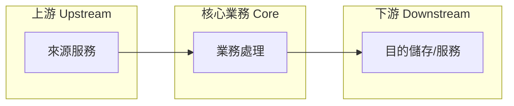

# business-extract

從任意輸入脈絡中萃取純業務邏輯，產出一份只談業務價值的 Markdown 報告。

## Overview

輸入可以是 folder、repo、單一檔案、文件或貼上的文字。輸出永遠只回答一個問題：
這個系統對「業務」做了什麼？技術實作（框架、建置、部署、設定同步）一律排除。

與 `project-explore` 的區隔：`project-explore` 產出 README/CLAUDE.md 完整文件；
本技能只做業務深度分析，不寫技術文件，且輸入不限於 workspace。

## When to Use

- 使用者要求分析某段程式、某個 repo 或某份文件的業務價值
- 接手陌生系統前，需要先理解業務上下游與狀態流轉
- 評估合規/風險（KYC、AML、隱私、資料遺失）暴露面
- 不適用：需要技術架構文件時改用 `project-explore`

## Procedure

### Step 1 — 界定輸入範圍 (Scope)

| 輸入型態    | 處理方式                                                      |
| :---------- | :------------------------------------------------------------ |
| folder/repo | Glob 頂層結構，鎖定 entry points、handler/service/cmd、設定檔 |
| 單一檔案    | 直接 Read，必要時追蹤其直接相依檔案                           |
| 文件/純文字 | 直接分析，不掃描檔案系統                                      |

排除噪音：`.git`, `node_modules`, `vendor`, `dist`, 產生碼 (`gen/`, `*_gen/`)。
只讀高訊號檔案，不逐檔閱讀。

### Step 2 — 識別核心業務與常見操作 (Core Business & Operations)

1. 找出系統存在的理由：它替誰、解決什麼問題、產生什麼價值
2. 列出常見業務操作 (common operations)：使用者或排程實際觸發的動作，
   以業務動詞描述（如「蒸餾記憶」「匯出資料」），不是函數名清單

### Step 3 — 上下游服務對應 (Upstream / Downstream)

明確區分三層並以 Mermaid `flowchart LR` 呈現：

- 上游 (Upstream)：資料或請求的來源（外部服務、資料庫、使用者輸入）
- 本體 (Core)：本系統的業務處理
- 下游 (Downstream)：輸出去向（寫入的儲存、呼叫的外部 API、通知對象）



### Step 4 — 狀態與流程 (Status / Flow)

找出業務物件的生命週期狀態（如 `pending → processed → archived`），
以 Mermaid `stateDiagram-v2` 呈現；若無明確狀態機，改用 `flowchart TD`
描述主要業務流程。狀態名稱必須來自實際程式或文件，不可虛構。

### Step 5 — 業務約束 (Constraints)

列出限制業務行為的規則，每條附上來源依據：

- 准入/品質門檻（如真實性驗證、來源數量要求）
- 去重/冪等規則
- 時效/保留政策 (retention)
- 額度、頻率、排程限制

### Step 6 — 風險偵測 (Risk Detection)

逐項檢查並回報「有/無/不適用」，不可整節省略：

| 風險類別            | 檢查重點                         |
| :------------------ | :------------------------------- |
| 身分/合規 (KYC/AML) | 是否處理身分、金流、需驗證的對象 |
| 隱私 (Privacy)      | 個資、對話紀錄是否外流至第三方   |
| 資料完整性          | 遺失、重複、競態造成的業務錯誤   |
| 依賴風險            | 上下游服務不可用時業務是否停擺   |

### Step 7 — 核心與非核心業務 (Core vs Non-core)

二分清單：核心業務直接產生主要價值；非核心業務（匯出、清理、報表、
初始化等）支撐核心成長。每個非核心項目需註明它如何幫助核心業務。

### Step 8 — 寫入報告 (Write Report)

folder/repo 輸入時，報告同步寫入兩個位置（`<name>` 為目標路徑最後一段，
即專案名稱）：

1. `<target>/README.business.md` — 分析目標根目錄
2. `~/projects/product/projects/<name>/README.business.md` — 集中產品文件庫
   （目錄不存在時先 `mkdir -p` 建立）

使用者指定路徑時以指定為準；純文字輸入且未指定路徑時，輸出於對話並
詢問是否落檔。報告結構：

```markdown
# <名稱> — 業務分析 (Business Analysis)

## 業務目的 (Purpose)

## 常見業務操作 (Common Operations)

## 上下游服務 (Upstream / Downstream)

## 狀態與流程 (Status / Flow)

## 業務約束 (Constraints)

## 風險偵測 (Risk Detection)

## 核心業務 (Core Business)

## 非核心業務 (Non-core Business)
```

## Rules

- 章節標題用繁體中文加英文括號；內文遵循輸入的原始語言慣例
- 八個章節缺一不可；查無資料的章節明寫「未偵測到 (Not detected)」
- 禁止技術實作細節：建置、部署、設定同步、套件清單都不屬於業務
- 圖表一律 Mermaid；狀態與名詞必須有程式或文件依據，禁止虛構
- 不使用粗體強調，改用 `backtick`

## Common Mistakes

| 錯誤                               | 修正                                    |
| ---------------------------------- | --------------------------------------- |
| 把環境初始化、設定同步當成業務領域 | 歸入非核心或直接排除                    |
| 只描述流程、不畫狀態機             | 業務物件有狀態欄位就必須有 stateDiagram |
| 略過風險章節因為「看起來沒風險」   | 逐類別回報「無」也是結論                |
| 全部列為核心業務                   | 強制二分，非核心需說明如何支撐核心      |
| 用函數名稱清單冒充業務操作         | 改寫為業務動詞 + 觸發者 + 結果          |

## Failure Modes

| 情境                              | 動作                                           |
| --------------------------------- | ---------------------------------------------- |
| 輸入過大無法全讀                  | 鎖定 entry points 與領域模型，註明「部分掃描」 |
| 找不到明確狀態機                  | 改用 flowchart 描述業務流程並註明              |
| 業務邊界不明                      | 依目錄/模組分組並註明「邊界不明確」            |
| 任一位置已有 `README.business.md` | 讀取後合併更新，保留仍正確的內容               |
