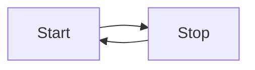

# Markdown Sample

[TOC]

Markdown Preview Enhanced [Doc](https://shd101wyy.github.io/markdown-preview-enhanced/#/zh-tw/toc)  

⭕️❌🔰💫🌟⚡️🔥✅🔱❗⭐

[TODO] format  
File Structure:  
    行政事務紀錄:  
        完成後移動到 history.todo  

Noting Guideline:  
    [Notice]: Need to know on overall scope  
    "// [Notice]:": as same as above  
    [Tip]: Tricky point. need to know on local scope, typically on the file  
    [Hint]: Where it needs to do something  
    Algo + Programming Language:  
        "[Pattern]: [<Pattern Name>] desc"  
        "[Question]:"  
        "[Solution]:"  
        "[Variant]: [<Pattern Name>]": Variant from classic pattern  
        "// Warning: xxxx"

Warning: xxxxx
TODO: xxxxx
NOTE: xxxxx
FIX: xxxxx
BUG: xxxxx
ISSUE: xxxxx
FIXME: xxxxx
Warning: xxxxx
???
@xxxxx
===== xxxxx =====
"xxxxx"
'xxxxx'
<xxxxx>
`xxxxx`
[xxxxx]

## Note Block

!!! Warning Separate maintenance teams and matrix organizations , work against responsiveness => feedback loop is broken and lost

!!! note note
    XXXX
!!! summary summary
    XXXX

!!! info info
    XXXX

!!! hint hint
    XXXX

!!! check check
    XXXX

!!! done done
    XXXX

!!! help help
    XXXX

!!! warning warning
    XXXX

!!! danger danger
    XXXX
!!! error error
    XXXX
!!! bug bug
    XXXX

!!! quote quote
    XXXX

## GitHub Note Block

> Optional information to help a user be more successful.

> [!IMPORTANT]  
> Crucial information necessary for users to succeed.

> [!WARNING]  
> Critical content demanding immediate user attention due to potential risks.

> [!CAUTION]
> Negative potential consequences of an action.

## footnote

aaaa[^1] asdas
: 1
: 2
: 3

[^1]: This is the first footnote.

H~2~O[^2] asdas

[^2]: Here's one with multiple paragraphs and code.

    Indent paragraphs to include them in the footnote.

    `{ my code }`

    Add as many paragraphs as you like.

## Abbr

Test for HTML and W3C

*[HTML]: Hyper Text Markup Language  
*[W3C]:  World Wide Web Consortium  

## emoji

:joy:

## Math Block

```math
\displaystyle
\left( \sum_{k=1}^n a_k b_k \right)^2
\leq
\left( \sum_{k=1}^n a_k^2 \right)
\left( \sum_{k=1}^n b_k^2 \right)
```

```math
f(x) = sin(x) +X^2
```

## mermaid

[Mermaid graph](https://mermaid.js.org/intro/)



## Code Block

```bash {cmd="bash"}
ls .
```

```golang {cmd="go run" .line-numbers}
func main() {
    
}
```

```python
print(12345)
```

## checkbox

[ ] A

- [ ] B

## Superscript and subscript

H~2~O

X^2^

## Marked

==marked==

Addition {++ ++}
Deletion {-- --}
Substitution {~~ ~> ~~}
Comment {>> <<}
Highlight {== ==}{>> <<}

## file import

@import "clean.sh" {class="line-numbers"}
