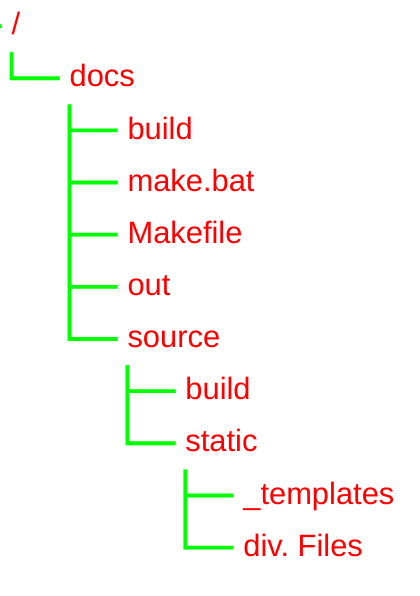

# TreeView (樹狀列表圖)

- 關鍵字：`treeView-beta`
- 說明：展示如作業系統檔案目錄、專案結構等純文字階層結構。

```mermaid
---
config:
    treeView:
        rowIndent: 25
        lineThickness: 2
    themeVariables:
        treeView:
            labelFontSize: '16px'
            labelColor: '#FF0000'
            lineColor: '#00FF00'
---
treeView-beta
            "docs"
                "build"
                "make.bat"
                "Makefile"
                "out"
                "source"
                    "build"
                    "static"
                        "_templates"
                        "div. Files"
```
