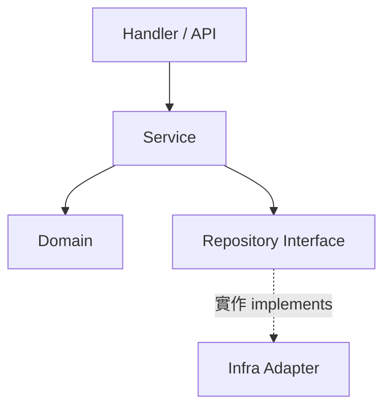

# system-planner

指導 AI 代理 (AI Agent) 量測現有系統的複雜度與架構痛點，設計解耦與分層方案，規劃可擴充的模組化/插件化機制，並以漸進、可驗證的路徑落地。

> `Planning Only`：本技能只產出架構演進計畫，不實作、不重構、不修改任何
> 程式碼或設定，唯一寫入的檔案是 `${cwd}/plans/` 下的計畫報告。

## 概述 (Overview)

輸入為一個 repo 或子目錄。輸出回答：這個系統「哪裡太複雜、為什麼、怎麼拆、
拆的順序、怎麼確保不拆壞」。所有結論必須有程式或量測依據，不可憑感覺。

與相鄰技能的分工：

| 技能 (Skill)       | 角色 (Role)                         |
| ------------------ | ----------------------------------- |
| `project-explore`  | 產出 README/CLAUDE.md 完整現況文件  |
| `business-planner` | 規劃業務該往哪長                    |
| `system-planner`   | 規劃架構怎麼撐起成長與簡化 — 本技能 |

## 使用時機 (When to Use)

- 程式碼體積膨脹、模組高度耦合、改一處牽動多處。
- 需引進模組化/插件化架構以支撐未來擴充。
- 不適用：規劃商業價值擴充時改用 `business-planner`；
  僅需理解現況產文件時改用 `project-explore`。

## 執行步驟 (Procedure)

### Step 1 — 複雜度量測與痛點診斷 (Complexity Metrics & Diagnosis)

先量測再判斷，蒐集客觀訊號（依語言調整指令）：

| 訊號 (Signal)          | 取得方式 (How)                                  |
| :--------------------- | :---------------------------------------------- |
| 熱點/改動頻繁檔        | `git log --since=12.month --name-only` 統計次數 |
| 巨型檔/長函數          | `wc -l`、超長函數掃描                           |
| 扇入/扇出 (Fan-in/out) | Grep import/引用，找被依賴最廣與依賴最多的模組  |
| 循環相依 (Cycles)      | 套件依賴圖檢查環狀引用                          |
| 重複代碼               | 相似區塊比對                                    |

排除噪音：`.git`, `node_modules`, `vendor`, `dist`, 產生碼。
聚焦「高改動 × 高耦合」交集 — 那是重構 ROI 最高處。

### Step 2 — 簡化與解耦設計 (Simplification & Decoupling)

1. 定義清楚的分層（如 `Domain` / `Service` / `Repository`），明訂依賴方向：
   只能由外層指向內層 (依賴反轉 Dependency Inversion)。
2. 在耦合熱點插入介面 (Interface) 接縫，隔離具體實作。
3. 提取通用邏輯至共享包 (Shared Package)；消除循環相依。



### Step 3 — 目錄與模組重整 (Directory & Module Reorganization)

1. 設計重整後目錄樹，確保職責單一 (Single Responsibility)。
2. 提供舊→新遷移映射表 (Migration Map)，標註每筆的依賴方向是否合規。
3. 明訂每個目錄的依賴原則（底層不可相依高層）。

### Step 4 — 可擴充性與插件化 (Extensibility & Plugin System)

1. 先判斷「是否需要」：擴充點少於 2~3 個時，介面+組合即可，勿過度設計。
2. 若需要，定義核心與插件的 `契約 (Interface / API Contract)`。
3. 設計載入機制：註冊表 (Registry)、配置驅動或事件驅動 (Event-driven)，
   依需求選最簡可行者。

### Step 5 — 漸進式遷移與安全網 (Incremental Migration & Safety Net)

1. 重構前先補關鍵路徑的特徵測試 (Characterization Test) 作為安全網。
2. 採絞殺榕模式 (Strangler-Fig)：新舊並存、逐步切換，每步可獨立交付與回滾。
3. 依「風險低、收益高」排序步驟；每步定義驗證方式（測試綠燈、行為不變）。

### Step 6 — 撰寫架構演進計畫 (Write Evolution Plan)

`<feature_name>` 取與變更計畫 (change plan) 相關之名稱，或目標路徑最後一段。報告寫入
`./plans/architecture-<feature_name>.md`（目錄不存在先 `mkdir -p plans`）。
結構如下：

```markdown
# 架構演進與優化計畫 — <feature_name> (Architecture Evolution & Optimization Plan)

## 1. 現有架構診斷與技術債 (Architecture Diagnosis & Technical Debt)

## 2. 複雜度量測 (Complexity Metrics)

## 3. 架構簡化與解耦設計 (Simplification & Decoupling Design)

## 4. 目錄與模組重整方案 (Reorganization Map)

## 5. 插件化與可擴充性機制 (Plugin & Extensibility Mechanism)

## 6. 漸進式重構路徑與驗證 (Refactoring Roadmap & Verification)

## 7. 風險與回滾策略 (Risks & Rollback)
```

## 規則 (Rules)

- `僅規劃`：只產出計畫，不實作、不重構、不改設定；唯一輸出是 `./plans/` 下的報告。
- 章節標題用繁體中文加英文括號；內文使用繁體中文，術語附英文與圓括號。
- 不使用粗體語法，一律以 `backtick` 強調。
- 圖表一律 Mermaid；邊線文字 (edge text) 必須用雙引號包覆。
- 每個診斷結論必須附程式或量測依據；遷移步驟必須可獨立交付與回滾。
- 簡化方案以「移除」優先於「新增抽象」；插件機制需先論證必要性。

## 常見錯誤 (Common Mistakes)

| 錯誤                       | 修正                                  |
| -------------------------- | ------------------------------------- |
| 為簡化而引入過度複雜的機制 | 擴充點不足時，介面+組合即可           |
| 一次性大範圍重構           | 拆成可獨立交付、可回滾的小步          |
| 憑感覺判斷「哪裡髒」       | 先用 Step 1 量測，鎖定高改動×高耦合區 |
| 無測試就動刀               | 先補特徵測試再重構                    |
| 只畫新架構，缺遷移路徑     | 必附舊→新映射表與分步順序             |

## 失敗模式 (Failure Modes)

| 情境                 | 動作                                        |
| -------------------- | ------------------------------------------- |
| 系統龐大且無測試覆蓋 | 計畫第一階段優先補關鍵路徑測試              |
| 輸入過大無法全讀     | 鎖定高改動熱點與核心模組，註明部分掃描      |
| 循環相依過於盤根錯節 | 先以介面打破單一關鍵環，再逐步擴散          |
| 需求其實是業務擴充   | 移交 `business-planner`，本技能只處理架構面 |
