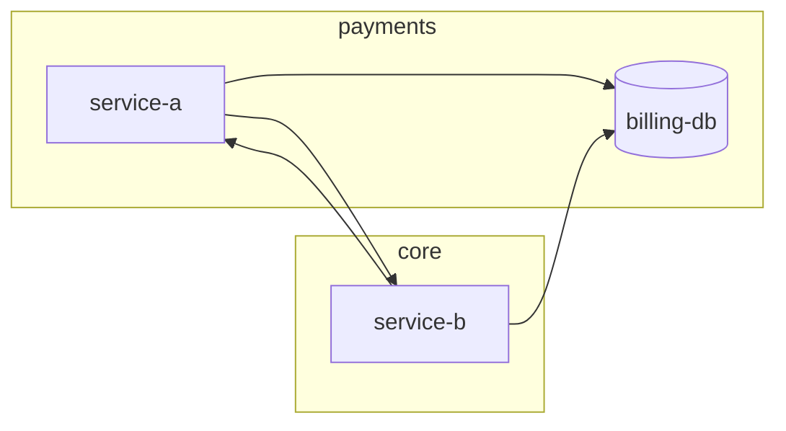

# Sample Topology Index

小型範例拓撲：3 entities、2 zones，示範 entity 檔、kind 標註、wikilink
有向邊、Backlinks、Frontier 與 Unlinked 的完整格式。

## Entity Registry

| Entity         | Zone     | Type      | Dimensions |
| :------------- | :------- | :-------- | :--------- |
| [[service-a]]  | payments | service   | 3          |
| [[billing-db]] | payments | datastore | 3          |
| [[service-b]]  | core     | service   | 3          |

## Overview Diagram

## Frontier

超出 2-hop、尚未建檔的實體（下一輪輸入）：

- `payment-gateway` — `service-b#Validate` 呼叫的外部收款 API

## Unlinked

無入邊 (no inbound)：

- 無 (None)

無出邊 (no outbound)：

- [[billing-db]]
