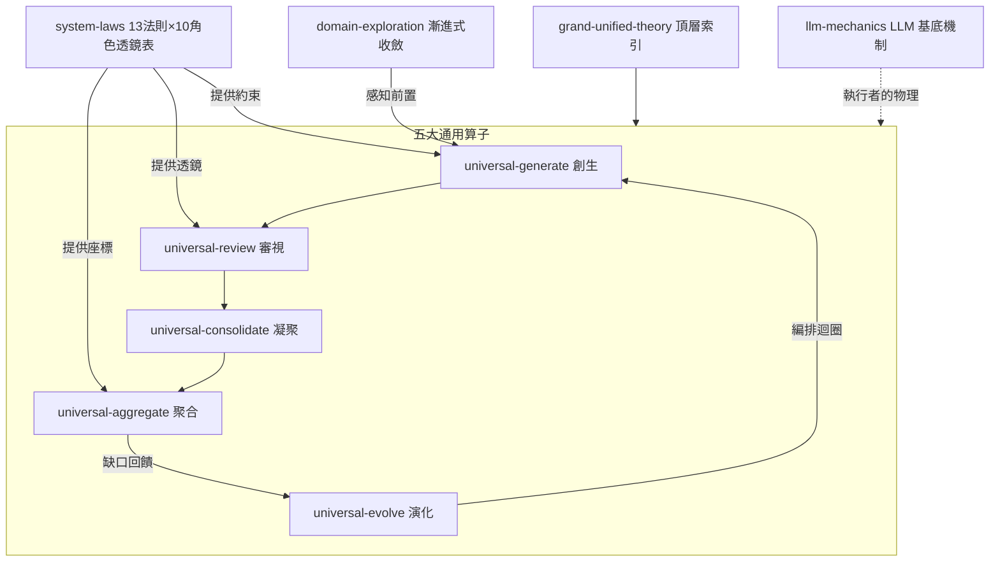

# god — 系統大一統理論插件 (Grand Unified Theory Plugin)

以`五大通用算子 (Five Universal Operators)`為核心的架構哲學插件：任何產物（程式碼、文件、技能、計畫、schema、系統）都可以被同一組基礎算子作用 — 創生、審視、凝聚、聚合、演化。

## 核心公理

`萬物皆產物，產物皆可被五算子作用`，且五算子可作用於自身（自我適用 self-hosting）。

## 技能結構



## 技能清單

| 技能 | 類型 | 一句話 |
| :--- | :--- | :--- |
| `universal-generate` | 算子 | 意圖 → 產物；探索 → 約束 → 生成 → 自審 |
| `universal-review` | 算子 | 產物 → 發現；正查缺陷 + 負查缺口 + 對抗驗證 |
| `universal-consolidate` | 算子 | 同類 ×N → 典範 ×1；四大融合思維工具 |
| `universal-aggregate` | 算子 | 異類 ×N → 整體 ×1；定座標 → 對映 → 負空間 |
| `universal-evolve` | 算子 | 迴圈 + 選擇 + 記憶；編排其他四算子 |
| `system-laws` | 透鏡 | 13 法則 × 10 角色透鏡表，缺格即候選缺陷 |
| `domain-exploration` | 前置 | 未知領域三階段漸進式收斂 |
| `llm-mechanics` | 基底 | LLM 的高維矩陣運算本質與提示詞策略 |
| `grand-unified-theory` | 索引 | 全理論頂層參考 |

## 使用方式

```bash
# 安裝為 Claude Code 插件（於 repo 根目錄）
claude --plugin-dir .
```

典型觸發：

- 「幫我建立一個新的 X」→ `universal-generate`
- 「審查這份設計，看缺了什麼」→ `universal-review` + `system-laws`
- 「這兩個東西重複了，怎麼合」→ `universal-consolidate`
- 「把這些拼成一張總覽」→ `universal-aggregate`
- 「這系統要怎麼持續改進」→ `universal-evolve`

## 參考資料 (references/)

- `ontology-template.md` — 系統本體論與資料定義範本（座標系統、詞彙表、元素透鏡、城市透鏡）
- `12條宇宙法則.md` — 理論的靈感來源文獻

## 版本沿革

- `2.0.0` — 以五大通用算子重構：8 個 `system-law-*` 凝聚為 `system-laws`（並補齊冰霜/烈焰/雷霆/光明/黑暗 5 法則）、`fusion-methods` 併入 `universal-consolidate`、`unified-matrix` 併入 `universal-aggregate`
- `1.0.0` — 以 13 法則為軸的初版
