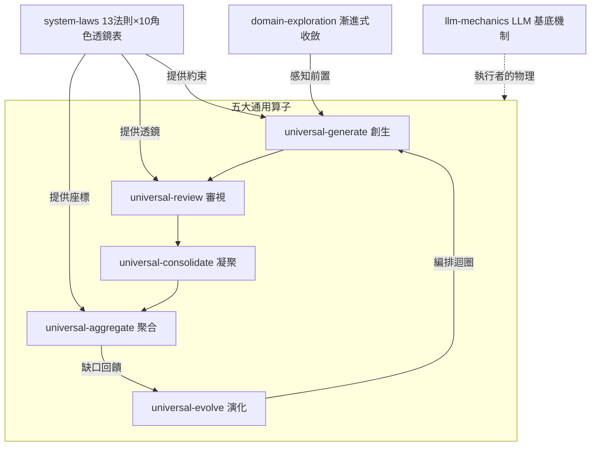

# god — 系統大一統理論插件 (Grand Unified Theory Plugin)

以`五大通用算子 (Five Universal Operators)`為核心的架構哲學插件：任何產物（程式碼、文件、技能、計畫、schema、系統）都可以被同一組基礎算子作用 — 創生、審視、凝聚、聚合、演化。

## 核心公理

`萬物皆產物，產物皆可被五算子作用`，且五算子可作用於自身（自我適用 self-hosting）。

## 技能結構


```mermaid
graph TD
    subgraph OPS [五大通用算子]
        G[universal-generate 創生]
        R[universal-review 審視]
        C[universal-consolidate 凝聚]
        A[universal-aggregate 聚合]
        E[universal-evolve 演化]
    end
    SL[system-laws 13法則×10角色透鏡表] -->|"提供透鏡"| R
    SL -->|"提供約束"| G
    SL -->|"提供座標"| A
    DE[domain-exploration 漸進式收斂] -->|"感知前置"| G
    LM[llm-mechanics LLM 基底機制] -.->|"執行者的物理"| OPS
    E -->|"編排迴圈"| G
    G --> R --> C --> A -->|"缺口回饋"| E
```

## 技能清單

| 技能 | 類型 | 一句話 |
| :--- | :--- | :--- |
| `universal-generate` | 算子 | 意圖 → 產物；探索 → 約束 → 生成 → 自審 |
| `universal-review` | 算子 | 產物 → 發現；正查缺陷 + 負查缺口 + 對抗驗證 |
| `universal-consolidate` | 算子 | 同類 ×N → 典範 ×1；四大融合思維工具 |
| `universal-aggregate` | 算子 | 異類 ×N → 整體 ×1；定座標 → 對映 → 負空間 |
| `universal-evolve` | 算子 | 迴圈 + 選擇 + 記憶；編排其他四算子 |
| `system-laws` | 透鏡 | 13 法則 × 10 角色透鏡表，缺格即候選缺陷 |
| `domain-exploration` | 前置 | 未知領域三階段漸進式收斂 |
| `llm-mechanics` | 基底 | Thinking Mode 模型的 prompt 詳略取捨 |

## 算子組合總覽 (Operator Composition)

原 `grand-unified-theory` skill 的索引內容併入本節；它沒有可執行步驟，不適合作為 skill 存在。

- `封閉性`：`evolve` 是前四個算子的閉合迴圈 — `generate → review → consolidate → aggregate` 產出的缺口回饋給 `evolve`，由它決定下一輪作用於誰。
- `自我適用 (self-hosting)`：五算子可作用於自身 — 生成技能、審視審查流程、凝聚技能庫、聚合成插件、演化整個系統。
- `透鏡供應`：`system-laws` 的 13 法則 × 10 角色表同時餵給三個算子 — `review` 用它找缺陷、`aggregate` 用它找缺格、`generate` 用它設約束。
- `四大域`：`宇宙基石`（空間、時間、重力、因果）、`系統意志`（混沌、精神、生命、破壞）、`元素力量`（冰霜、烈焰、雷霆）、`狀態邊界`（光明、黑暗）。
- `四大融合思維工具`：正交性、同構性、催化劑、辯證循環 — 方法細節見 `universal-consolidate`。
- `四大終極融合體`：時空運行矩陣（正交性）、能量守恆引擎（同構性）、零信任稜鏡（催化劑）、無限演化之輪（辯證循環） — 矩陣全表與完整性檢查見 `universal-aggregate`。
- `感知前置`：面對未知領域時 `domain-exploration` 先於 `generate`，先收斂再創生。

## 使用方式

```bash
# 安裝為 Claude Code 插件（於 repo 根目錄）
claude --plugin-dir .
```

典型觸發：

- 「幫我建立一個新的 X」→ `universal-generate`
- 「審查這份設計，看缺了什麼」→ `universal-review` + `system-laws`
- 「這兩個東西重複了，怎麼合」→ `universal-consolidate`
- 「把這些拼成一張總覽」→ `universal-aggregate`
- 「這系統要怎麼持續改進」→ `universal-evolve`

## 參考資料 (references/)

參考檔案隨其唯一消費者的 skill 存放，不集中在 plugin 根層：

- `skills/universal-aggregate/references/ontology-template.md` — 系統本體論與資料定義範本（座標系統、詞彙表、元素透鏡、城市透鏡）
- `skills/system-laws/references/design-principles.md` — 13 法則各自的設計原則

## 版本沿革

- `2.1.0` — `grand-unified-theory` skill 移除（內容併入本 README 的算子組合總覽）；`llm-mechanics` 改寫為 prompt 詳略取捨；`system-laws` 設計原則與 `universal-aggregate` 本體論範本外移至各自 `references/`
- `2.0.0` — 以五大通用算子重構：8 個 `system-law-*` 凝聚為 `system-laws`（並補齊冰霜/烈焰/雷霆/光明/黑暗 5 法則）、`fusion-methods` 併入 `universal-consolidate`、`unified-matrix` 併入 `universal-aggregate`
- `1.0.0` — 以 13 法則為軸的初版
