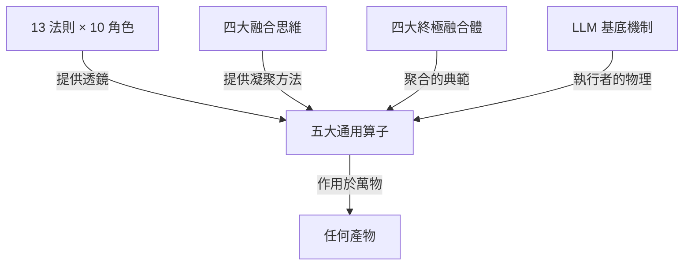

# grand-unified-theory — 系統大一統理論

從語言模型底層邏輯到宏觀架構哲學的頂層索引。核心公理：`萬物皆產物，產物皆可被五算子作用`。

## 理論結構

## 壹、五大通用算子 (Five Universal Operators)

| 算子 | 簽名 | 本質 | 技能 |
| :--- | :--- | :--- | :--- |
| 創生 (generate) | 意圖 → 產物 | 從無到有 | `universal-generate` |
| 審視 (review) | 產物 → 發現 | 對照透鏡，正查 + 負查 | `universal-review` |
| 凝聚 (consolidate) | 同類 ×N → 典範 ×1 | 去重合一 | `universal-consolidate` |
| 聚合 (aggregate) | 異類 ×N → 整體 ×1 | 組合升維 | `universal-aggregate` |
| 演化 (evolve) | 產物 + 回饋 + 記憶 → 產物' | 迴圈 + 選擇 + 記憶 | `universal-evolve` |

封閉性：evolve 是前四者的閉合迴圈；五算子可作用於自身（生成技能、審視審查、凝聚技能庫、聚合成插件、演化整個系統）。

## 貳、13 法則 × 10 角色

四大域：`宇宙基石`（空間、時間、重力、因果）、`系統意志`（混沌、精神、生命、破壞）、`元素力量`（冰霜、烈焰、雷霆）、`狀態邊界`（光明、黑暗）。

完整透鏡表見 `system-laws`。

## 參、四大融合思維工具

1. `正交性 (Orthogonality)` — 垂直交叉，互不干涉
2. `同構性 (Isomorphism)` — 剝除表象，找底層共同結構
3. `催化劑 (Catalyst)` — 互斥概念間插入輕量協議
4. `辯證循環 (Dialectical Cycle)` — 對立概念拉長至時間軸成生命週期

方法細節見 `universal-consolidate`。

## 肆、四大終極融合體

時空運行矩陣（正交性）、能量守恆引擎（同構性）、零信任稜鏡（催化劑）、無限演化之輪（辯證循環）。矩陣全表與完整性檢查見 `universal-aggregate`。

## 伍、基底：LLM 機制與探索策略

- `llm-mechanics` — 語言模型是高維空間的「找方向、算距離」矩陣運算
- `domain-exploration` — 未知領域的漸進式收斂：地貌掃描 → 插旗測試 → 結構化收斂

## 最終哲學

> 最頂級的成就永遠不是追求量化的極限數據，而是觸達底層的`共鳴 (Resonance)`、建立`永恆的秩序 (Eternal Order)`，以及帶來`視野的啟蒙 (Paradigm Shift)`。
