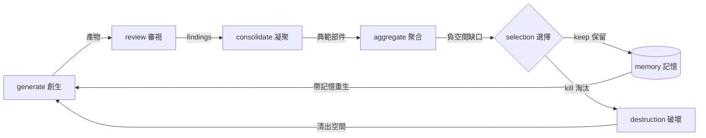

# universal-evolve — 演化算子

`簽名 (Signature)`：產物 + 回饋 + 記憶 → 產物'，迴圈 (loop)

演化是其他四個算子的閉合迴圈，加上兩個獨有要素：`選擇 (selection)` 與 `記憶 (memory)`。沒有選擇的迭代是漂移，沒有記憶的迭代是輪迴。

## 演化迴圈

## 五要素

### 1. 迴圈 (Loop)

一輪 = generate → review → consolidate → aggregate。每輪產出一個可用版本，不做半成品過夜。

### 2. 選擇 (Selection)

每輪結束明確判定每個產物：`保留` / `修改` / `淘汰`。淘汰遵循破壞法則：有時間表、有遷移路徑、真的刪除（不留殭屍）。

### 3. 記憶 (Memory)

跨輪傳遞的不是產物本身，而是`教訓 (lessons)`：

- 哪些約束被驗證為真（升級為不變式）
- 哪些嘗試失敗與原因（避免輪迴）
- 版本號遞增記錄語意變化（major = 座標軸變了）

### 4. 生命 (Keep-Alive)

演化中的系統必須持續存活：每輪改動保持可運作狀態，變更可回退。大重構用絞殺者模式 (strangler fig)：新舊並存 → 流量遷移 → 舊件安樂死。

### 5. 收斂判準 (Convergence)

明確的停止條件，避免無限迭代：

- `loop-until-dry`：連續 K 輪 review 無新發現 → 收斂
- `目標達成`：驗收條件全綠 → 停
- `報酬遞減`：一輪的改善 < 一輪的成本 → 停

## 反模式

| 反模式 | 問題 | 修正 |
| :--- | :--- | :--- |
| 只加不刪 | 熵增、腐朽累積 | 每輪必有 selection，敢於淘汰 |
| 無記憶迭代 | 重複踩同一坑 | 每輪沉澱 lessons |
| 大爆炸重寫 | 長期不可用、風險集中 | 絞殺者模式，每輪可運作 |
| 無收斂判準 | 永遠在改、永遠不完成 | 開始前定義停止條件 |

## 算子組合

`evolve` 是最高階算子：它不直接操作產物，而是編排另外四個算子。自我適用 (self-hosting)：evolve 可以演化 evolve 本身 — 對這套算子做 generate/review/consolidate/aggregate 的對象也可以是這五個技能。
