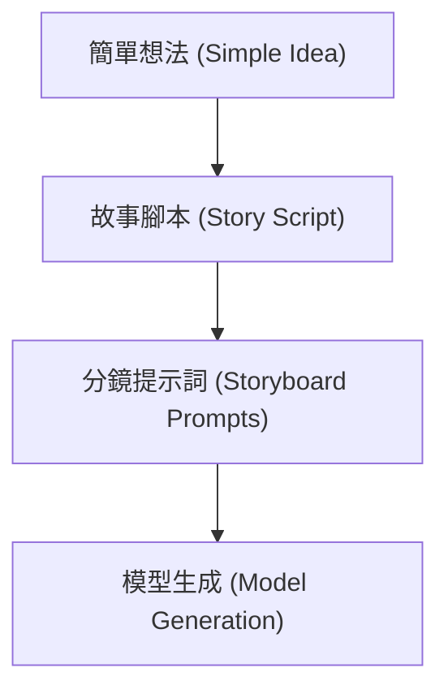

# AI 影片生成與提示詞優化指南 (AI Video Generation and Prompt Optimization Guide)

本指南旨在說明 AI 影片生成 (AI Video Generation) 的核心提示詞撰寫原則、分鏡拆解策略、主流模型比較，以及如何利用 `media` 插件中的技能來加速創作流程。
TODO: read this ai video

---

## 核心工作流 (Core Workflow)

此插件提供了一條完整的影片生成工作流，將創意想法一步步轉化為最終的影片分鏡提示詞：

- 步驟一：使用 `prompt-to-story-script` 技能將簡單靈感擴展成具備情節起伏的「畫面化」腳本。
- 步驟二：使用 `scene-to-video-prompt` 技能將腳本拆解為符合各影片模型輸入規範的「分鏡提示詞」。
- 步驟三：將分鏡提示詞貼入 `Kling` 或 `Seedance` 等模型介面進行生成。

---

## 影片提示詞撰寫原則 (Prompt Engineering Principles)

高質感的影片提示詞如同向攝影師下達的具體指令，應包含以下六個要素：

1. `主體 (Subject)`：畫面中的主角或核心物件，描述需具體（例如：`a young woman with short black hair, wearing a beige trench coat`）。
2. `動作 (Action)`：主體進行的具體動態（例如：`slowly turning her head to look at the camera`）。
3. `場景與環境 (Setting / Environment)`：故事發生的背景與時間（例如：`in a rainy Tokyo street at night, neon signs reflecting on wet pavement`）。
4. `鏡頭語言 (Camera / Shot Type)`：指定鏡頭運動與畫面景別（例如：`close-up`、`medium shot`、`wide shot`；運鏡如 `dolly in`、`pan left`、`tracking shot`；以及 `shallow depth of field` 淺景深）。
5. `光線與氛圍 (Lighting / Mood)`：形塑整體影片基調（例如：`golden hour, warm soft light` 或 `moody, low-key lighting`）。
6. `風格 (Style)`：指定影片的藝術形式（例如：`cinematic, shot on 35mm film` 或 `3D Pixar style animation`）。

### 提示詞範例 (Prompt Example)

> `Medium shot, a young woman with short black hair in a beige trench coat slowly turning to look at the camera, rainy Tokyo street at night, neon reflections on wet ground, shallow depth of field, cinematic, moody lighting.`

---

## 分鏡拆解原則 (Scene Breakdown Principles)

由於現行 AI 影片模型單次生成長度多限制在 5 至 10 秒，且單一鏡頭內動作過於複雜容易導致畫面崩壞，因此必須遵循「一個鏡頭只做一件事」的原則進行分鏡。

### 換鏡時機 (Shot Switching Criteria)

凡遇到以下變化，即應拆分為新鏡頭：

- `場景改變` (例如：從室內切換至室外)
- `景別改變` (例如：從遠景切換至特寫)
- `時間跳躍` (例如：從白天變為夜晚)
- `主要動作改變` (例如：從走路變為坐下)

### 一致性控制 (Consistency Control)

為了在跨鏡頭間維持角色或場景的一致性，在不同鏡頭的提示詞中，關於主角的外觀描述（髮型、服裝、色彩等）必須`完全一致`，避免模型因詞彙變更而重新理解。

---

## 主流影片模型比較 (AI Video Model Comparison)

以下為 2026 年 6 月主流 AI 影片模型的特點與適用情境：

| 模型名稱 (Model) | 最強項 (Strengths) | 解析度/長度 (Specs) | 免費方案 (Free Tier)   | 適合群眾 (Target Audience) |
| :--------------- | :----------------- | :------------------ | :--------------------- | :------------------------- |
| `Kling 3.0`      | 高性價比、運鏡自然 | 4K @ 60fps / 10 秒  | 每日免費 66 點         | 新手起步、預算有限者       |
| `Seedance 2.0`   | 角色一致性、多模態 | 1080p / 15 秒       | 有限免費額度           | 連續劇情、品牌角色創作     |
| `Sora 2`         | 物理擬真、長片段   | 高畫質 / 25 秒      | 包含於 ChatGPT 訂閱    | 寫實風格、複雜物理互動     |
| `Veo 3.1`        | 電影畫質、語音同步 | 4K / 支援語音對白   | 透過 Gemini 有限免費   | 需要人物說話或專業配音     |
| `Runway Gen-4.5` | 創作工具生態整合   | 高畫質              | 訂閱制                 | 需要邊生成邊剪輯的專業用戶 |
| `Wan 2.2 / 2.6`  | 開源、可本地部署   | 720p - 1080p        | 完全免費（需本機 GPU） | 具備硬體資源、想無限生成者 |

### 模型選擇指引 (Selection Guide)

- 選擇 `Kling 3.0` 作為國民神車：高性價比、免信用卡即可使用，適合作為日常試錯與練習工具。
- 選擇 `Seedance 2.0` 作為角色專車：針對多鏡頭故事，其人臉鎖定與角色一致性能力最為突出。
- 選擇 `Sora 2` 作為越野悍將：物理規律模擬最優，且單次生成長度最長。
- 選擇 `Veo 3.1` 作為語音房車：具備最強的對白與音訊同步能力。

---

## 分鏡提示詞介面工具 (Storyboard Tools & Interfaces)

若需要利用分鏡介面進行多鏡頭協同生成，有以下兩類工具：

### 1. 模型內建分鏡介面 (In-Model Storyboard)

- `Kling 3.0`：支援定義 3 至 12 個鏡頭，可各自設定提示詞、運鏡與轉場，並會自動維持視覺一致性。
- `Seedance 2.0`：支援多鏡頭敘事，並提供流暢的跨鏡頭背景音樂與對白銜接。
- `Veo 3.1`：可透過 Google Flow 平台的 Storyboard 與 Recut 工具排版生成。

### 2. 專業腳本至分鏡平台 (Script-to-Storyboard Platforms)

- `LTX Studio` 與 `M Studio`：適合長片創作。只需貼入整段文字劇本，平台會自動進行場景拆解，並生成對應的分鏡畫面、動態腳本 (Animatic) 與語音，提供一站式工作流程。

---

## 插件技能介紹 (Plugin Skills Overview)

在 `plugins/media/skills/` 目錄中，提供了以下核心技能：

- [character-setting](./skills/character-setting/SKILL.md)：用於定義與鎖定角色外觀特徵，以確保跨鏡頭一致性。
- [prompt-to-story-script](./skills/prompt-to-story-script/SKILL.md)：將簡單想法擴展為結構化故事腳本，包含 Logline、故事設定與三拍子/五拍子節奏。
- [scene-to-video-prompt](./skills/scene-to-video-prompt/SKILL.md)：將腳本段落轉換為包含六要素的 Kling/Seedance/Sora 相容英文提示詞。
