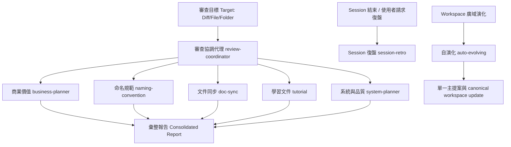

# 審查插件 (Review Plugin)

本插件提供程式碼審查、系統／商業規劃與 workspace 自演化工具，協助 `Claude Code` 等 AI 代理從多維度診斷問題、設計改善並在獲授權時完成更新。

審查協調代理預設維持 `唯讀 (Read-only)`，專注於衛生、一致性與業務價值診斷，不涵蓋執行邏輯正確性與安全漏洞。只有直接呼叫 `auto-evolving` 且未指定 plan-only 時，才會進入 `THINK → DESIGN → UPDATE → VERIFY → CONSOLIDATE` 的可寫入流程；外部、破壞性或不可逆操作仍須另外批准。

---

## 核心架構 (Core Architecture)

本插件由一個核心協調代理與七個專屬技能組成：

協調代理的 manifest 路徑為 `./agents/review-coordinator.md`。



---

## 審查維度與對應技能 (Review Dimensions and Corresponding Skills)

| 審查維度 (Review Dimension) | 對應技能 (Corresponding Skill) | 觸發條件 (Run Condition) |
| --- | --- | --- |
| 跨檔案一致性 (Cross-file coherence) | `system-planner` | 任何變更（預設一律啟用） |
| 商業價值分析 (Business value analysis) | `business-planner` | 審查業務摩擦點與缺陷，或規劃新功能的商業變現模式 |
| 目錄佈局調整 (Directory layout audit) | `system-planner` | 新增/移動檔案，或全專案審查時 |
| 識別子命名品質 (Identifier naming quality) | `naming-convention` | 任何程式碼、設定鍵值或 API 端點變更 |
| 文件與程式碼同步 (Docs vs code sync) | `doc-sync` | 涉及 README/CLAUDE.md、註解或文件編輯 |
| 外部依賴管理 (Dependency management) | `system-planner` | 涉及依賴清單檔案（如 go.mod, package.json 等） |
| 專案引導與學習 (Project onboarding) | `tutorial` | 請求建立步驟式教學、專案引導或概念學習文件時 |
| 程式碼編寫原則 (Coding principles) | `system-planner` | 任何程式碼、重融或審查請求 |
| 系統架構規劃 (System architecture planning) | `system-planner` | 規劃新功能或重構的系統架構與資料流 |
| Session 復盤 (Session retro) | `session-retro` | 請求復盤/post-mortem，分析 skill/token/錯誤率與委託邊界 |
| Workspace 廣域自演化 (Workspace evolution) | `auto-evolving` | 從使用者、業務、領域、系統、品質、運維、安全與知識等面向收斂一項改善，完成設計、更新、驗證與主流程知識整合 |

---

## 插件結構 (Plugin Structure)

```tree
.
├── .claude-plugin/
│   └── plugin.json          # 插件定義與技能註冊表 (Plugin Manifest)
├── agents/
│   └── review-coordinator.md # 審查協調代理 (Review Coordinator Agent)
└── skills/
    ├── auto-evolving/        # 廣域思考、單點設計、更新與知識整合 (Auto-Evolving Skill)
    ├── business-planner/     # 商業價值分析技能 (Business Value Skill)
    ├── doc-sync/             # 文件同步審查技能 (Doc Sync Skill)
    ├── tutorial/             # 教程建立技能 (Tutorial Skill)
    ├── naming-convention/    # 命名規範審查技能 (Naming Convention Skill)
    ├── session-retro/        # Session 復盤技能 (Session Retro Skill)
    ├── system-planner/       # 系統架構規劃與品質審查技能 (System & Quality Skill)
```

---

## 嚴重性分級與輸出格式 (Severity Grading and Output Format)

協調代理會對收集到的發現進行去重、交叉連結，並依照以下嚴重等級進行排序報告：

- `blocker` (阻擋者)：會破壞行為、資金或資料的矛盾與缺口。
- `major` (主要)：影響價值、結構或測試覆蓋的實質缺陷，應在當前 PR 中修復。
- `minor` (次要)：偏離慣例或衛生問題，可批次作為清理任務。
- `nit` (微小)：化妝性、排版或視覺小問題。
- `ok` (無問題)：該維度已審查且未發現問題。

---

## 安裝與使用 (Installation and Usage)

### 透過 `npx skills` 工具安裝

於專案根目錄下執行以下指令以安裝並註冊此插件：

```bash
npx skills add .
```

### 觸發審查

在與 AI 代理對話時，您可以透過呼叫 `review-coordinator` 代理或使用以下觸發詞來啟動審查：

- `全面審查`
- `review before merge`
- `do a full review`
- `audit consistency`
- `evolve this workspace`
- `think design update`
