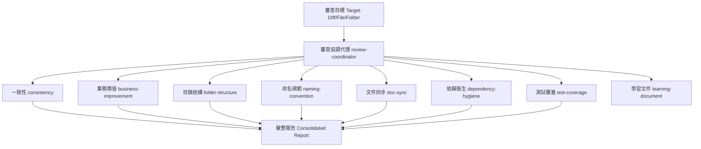

# 審查插件 (Review Plugin)

本插件提供一套完整的程式碼審查與品質診斷工具，旨在幫助 `Claude Code` 等 AI 代理對專案的變更、檔案、資料夾或整個程式碼庫進行多維度的靜態審查。

本插件的設計核心為 `唯讀 (Read-only)` 審查，專注於衛生、一致性與業務價值的診斷，不涉及執行邏輯的正確性與安全性缺陷（這些應交由專門的 Correctness 與 Security 代理）。

---

## 核心架構 (Core Architecture)

本插件由一個核心協調代理與八個專屬技能組成：



---

## 審查維度與對應技能 (Review Dimensions and Corresponding Skills)

| 審查維度 (Review Dimension) | 對應技能 (Corresponding Skill) | 觸發條件 (Run Condition) |
| --- | --- | --- |
| 跨檔案一致性 (Cross-file coherence) | `consistency` | 任何變更（預設一律啟用） |
| 業務流程改善 (Business flow improvement) | `business-improvement` | 涉及功能、流程或使用者行為的變更 |
| 目錄佈局調整 (Directory layout audit) | `folder-structure` | 新增/移動檔案，或全專案審查時 |
| 識別子命名品質 (Identifier naming quality) | `naming-convention` | 任何程式碼、設定鍵值或 API 端點變更 |
| 文件與程式碼同步 (Docs vs code sync) | `doc-sync` | 涉及 README/CLAUDE.md、註解或文件編輯 |
| 外部依賴管理 (Dependency management) | `dependency-hygiene` | 涉及依賴清單檔案（如 go.mod, package.json 等） |
| 測試覆蓋與品質 (Test coverage and quality) | `test-coverage` | 任何帶有邏輯的程式碼變更 |
| 專案引導與學習 (Project onboarding) | `learning-document` | 請求建立步驟式教學、專案引導或概念學習文件時 |

---

## 插件結構 (Plugin Structure)

```tree
.
├── .claude-plugin/
│   └── plugin.json          # 插件定義與技能註冊表 (Plugin Manifest)
├── agents/
│   └── review-coordinator.md # 審查協調代理 (Review Coordinator Agent)
└── skills/
    ├── business-improvement/ # 業務流程改善技能 (Business Improvement Skill)
    ├── consistency/          # 跨檔案一致性技能 (Consistency Skill)
    ├── dependency-hygiene/   # 依賴衛生審查技能 (Dependency Hygiene Skill)
    ├── doc-sync/             # 文件同步審查技能 (Doc Sync Skill)
    ├── folder-structure/     # 目錄結構審查技能 (Folder Structure Skill)
    ├── learning-document/    # 學習文件建立技能 (Learning Document Skill)
    ├── naming-convention/    # 命名規範審查技能 (Naming Convention Skill)
    └── test-coverage/        # 測試覆蓋率審查技能 (Test Coverage Skill)
```

---

## 嚴重性分級與輸出格式 (Severity Grading and Output Format)

協調代理會對收集到的發現進行去重、交叉連結，並依照以下嚴重等級進行排序報告：

- `blocker` (阻擋者)：會破壞行為、資金或資料的矛盾與缺口。
- `major` (主要)：影響價值、結構或測試覆蓋的實質缺陷，應在當前 PR 中修復。
- `minor` (次要)：偏離慣例或衛生問題，可批次作為清理任務。
- `nit` (微小)：化妝性、排版或視覺小問題。
- `ok` (無問題)：該維度已審查且未發現問題。

---

## 安裝與使用 (Installation and Usage)

### 透過 `npx skills` 工具安裝

於專案根目錄下執行以下指令以安裝並註冊此插件：

```bash
npx skills add .
```

### 觸發審查

在與 AI 代理對話時，您可以透過呼叫 `review-coordinator` 代理或使用以下觸發詞來啟動審查：

- `全面審查`
- `review before merge`
- `do a full review`
- `audit consistency`
