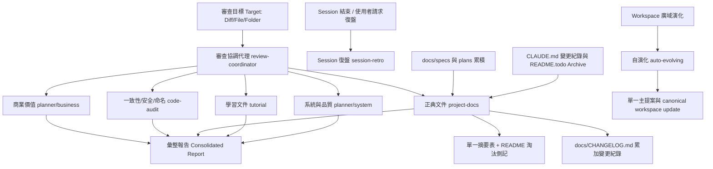

# 審查插件 (Review Plugin)

本插件提供程式碼審查、系統／商業規劃與 workspace 自演化工具，協助 `Claude Code` 等 AI 代理從多維度診斷問題、設計改善並在獲授權時完成更新。

審查協調代理預設維持 `唯讀 (Read-only)`，專注於衛生、一致性、安全與業務價值診斷，不涵蓋需要實際執行才能判定的邏輯正確性。兩個技能具備可寫入模式，且都必須由使用者明確要求才會啟用：`auto-evolving` 的 `THINK → DESIGN → UPDATE → VERIFY → CONSOLIDATE` 流程，以及 `project-docs` 的 `refresh` / `bootstrap` / `consolidate` / `scope` 模式（其 `audit` 模式為唯讀預設）。
其中 `consolidate` 會 `git rm` 已整併的歷史文件並就地移除已搬進 `docs/CHANGELOG.md` 的變更紀錄條目，`scope` 會刪除正典文件中越界的段落，兩者刪除前必先列出清單。外部、破壞性或不可逆操作仍須另外批准。

---

## 核心架構 (Core Architecture)

本插件由一個核心協調代理與六個專屬技能組成：

協調代理的 manifest 路徑為 `./agents/review-coordinator.md`。


```mermaid
graph TD
    Target[審查目標 Target: Diff/File/Folder] --> Coordinator[審查協調代理 review-coordinator]
    Coordinator --> S1[商業價值 planner/business]
    Coordinator --> S2[一致性/安全/命名 code-audit]
    Coordinator --> S3[正典文件 project-docs]
    Coordinator --> S4[學習文件 tutorial]
    Coordinator --> S5[系統與品質 planner/system]
    S1 --> Report[彙整報告 Consolidated Report]
    S2 --> Report
    S3 --> Report
    S4 --> Report
    S5 --> Report
    Session[Session 結束 / 使用者請求復盤] --> S6[Session 復盤 session-retro]
    Workspace[Workspace 廣域演化] --> Evolve[自演化 auto-evolving]
    Evolve --> MainFlow[單一主提案與 canonical workspace update]
    Docs[docs/specs 與 plans 累積] --> S3
    Hist[CLAUDE.md 變更紀錄與 README.todo Archive] --> S3
    S3 --> Summary[單一摘要表 + README 淘汰側記]
    S3 --> Changelog[docs/CHANGELOG.md 累加變更紀錄]
```

---

## 審查維度與對應技能 (Review Dimensions and Corresponding Skills)

| 審查維度 (Review Dimension) | 對應技能 (Corresponding Skill) | 觸發條件 (Run Condition) |
| --- | --- | --- |
| 跨檔案一致性 (Cross-file coherence) | `code-audit` | 任何變更（預設一律啟用） |
| 安全弱點稽核 (Security exposure) | `code-audit` | 涉及輸入處理、認證授權、機密、對外請求或依賴清單 |
| 商業價值分析 (Business value analysis) | `planner` | 審查業務摩擦點與缺陷，或規劃新功能的商業變現模式 |
| 目錄佈局調整 (Directory layout audit) | `planner` | 新增/移動檔案，或全專案審查時 |
| 識別子命名品質 (Identifier naming quality) | `code-audit` | 任何程式碼、設定鍵值或 API 端點變更 |
| 文件與程式碼同步 (Docs vs code sync) | `project-docs` | 涉及 README/CLAUDE.md、註解或文件編輯（協調代理只用 `audit` 唯讀模式） |
| 專案正典文件建立 (Canonical doc bootstrap) | `project-docs` | `README.md` / `CLAUDE.md` 缺漏、接手陌生 codebase 或大型重構之後 |
| 業務價值萃取 (Business extraction) | `project-docs` | 請求上下游、狀態流程、業務約束、風險或核心/非核心分析 |
| 歷史文件整併 (Docs consolidation) | `project-docs` | `docs/specs/` 或 `plans/` 累積過多，需壓縮成單一摘要表並清除已淘汰功能 |
| 變更紀錄搬移 (Changelog migration) | `project-docs` | `CLAUDE.md` 變更紀錄章節或 `README.todo` 的 `## Archive` 過長，需搬進 `docs/CHANGELOG.md` |
| 內容範疇清理 (Scope cleanup) | `project-docs` | `README.md` / `CLAUDE.md` 出現別的檔案擁有的內容，或高變動細節需下放 `docs/cli.md`、`docs/development.md` |
| 外部依賴管理 (Dependency management) | `planner` | 涉及依賴清單檔案（如 go.mod, package.json 等） |
| 專案引導與學習 (Project onboarding) | `tutorial` | 請求建立步驟式教學、專案引導或概念學習文件時 |
| 程式碼編寫原則 (Coding principles) | `planner` | 任何程式碼、重融或審查請求 |
| 系統架構規劃 (System architecture planning) | `planner` | 規劃新功能或重構的系統架構與資料流 |
| 商業模式規劃 (Business model planning) | `planner` | 規劃新功能的資產盤點、RICE 評分、商業模式與 MVP 驗證 |
| Session 復盤 (Session retro) | `session-retro` | 請求復盤/post-mortem，分析 skill/token/錯誤率與委託邊界 |
| Workspace 廣域自演化 (Workspace evolution) | `auto-evolving` | 從使用者、業務、領域、系統、品質、運維、安全與知識等面向收斂一項改善，完成設計、更新、驗證與主流程知識整合 |

---

## 插件結構 (Plugin Structure)

```tree
.
├── .claude-plugin/
│   └── plugin.json          # 插件定義與技能註冊表 (Plugin Manifest)
├── agents/
│   └── review-coordinator.md # 審查協調代理 (Review Coordinator Agent)
└── skills/
    ├── auto-evolving/        # 廣域思考、單點設計、更新與知識整合 (Auto-Evolving Skill)
    │   └── references/
    │       └── scoring.md    # 候選挑選用的八維權重表；`挑選啟發式，非驗證`
    ├── code-audit/           # 一致性、安全與命名的程式碼審查技能 (Code Audit Skill)
    │   └── references/
    │       ├── consistency.md # 一致性軸：業務規則、領域模型、數據合約、雙向參考
    │       ├── naming.md      # 命名軸：casing、同義詞漂移、語義空洞、對稱性
    │       └── security.md    # 安全軸：機密、輸入驗證、認證授權、傳輸加密、依賴
    ├── planner/              # 系統與商業的規劃與審查技能 (Planner Skill)
    │   └── references/
    │       ├── business.md   # 商業軸：資產盤點、RICE、商業模式、審查鏡頭
    │       └── system.md     # 系統軸：架構規劃、一致性、依賴衛生、目錄佈局
    ├── project-docs/         # 正典文件建立、稽核、整併與範疇清理技能 (Canonical Docs Skill)
    │   └── references/
    │       ├── content-ownership.md  # 內容歸屬判準與檔名規範；`全域規則的單一 owner`
    │       ├── consolidate.md        # 歷史壓縮與變更紀錄搬移的逐階段程序
    │       └── scope-cleanup.md      # 正典文件瘦身的逐階段程序
    ├── session-retro/        # Session 復盤技能 (Session Retro Skill)
    └── tutorial/             # 教程建立技能 (Tutorial Skill)
```

---

## 嚴重性分級與輸出格式 (Severity Grading and Output Format)

協調代理會對收集到的發現進行去重、交叉連結，並依照以下嚴重等級進行排序報告：

- `blocker` (阻擋者)：會破壞行為、資金或資料的矛盾與缺口。
- `major` (主要)：影響價值、結構或測試覆蓋的實質缺陷，應在當前 PR 中修復。
- `minor` (次要)：偏離慣例或衛生問題，可批次作為清理任務。
- `nit` (微小)：化妝性、排版或視覺小問題。
- `ok` (無問題)：該維度已審查且未發現問題。

---

## 安裝與使用 (Installation and Usage)

### 透過 `skills` 工具安裝

於專案根目錄下執行以下指令以安裝並註冊此插件：

```bash
skills add .
```

### 觸發審查

在與 AI 代理對話時，您可以透過呼叫 `review-coordinator` 代理或使用以下觸發詞來啟動審查：

- `全面審查`
- `review before merge`
- `do a full review`
- `audit consistency`
- `security review` / `安全稽核`
- `review naming` / `命名規範`
- `evolve this workspace`
- `think design update`
- `consolidate docs` / `文件整併`
