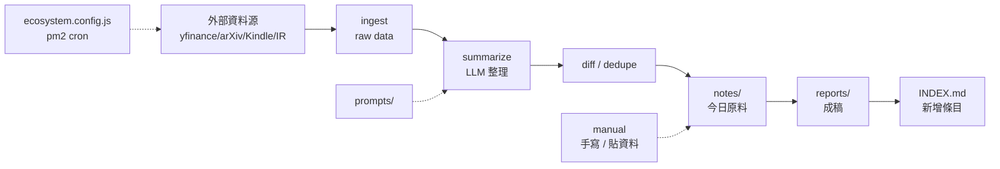
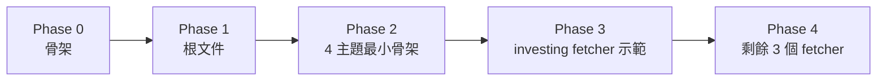

# Research Repo Bootstrap — 2026-07-13

> 把 `~/projects/research` 從空殼建成可長期演進、4 主題並列的研究容器。
> 採 Loose 模式（主題間不互引），4 主題全起 pm2 cron 自動抓取。

## 1. 目的與範圍

`research/` 是個人研究型 repo，承載 4 個獨立主題的長期筆記、原始資料與成稿報告：

| 主題 | 用途 | 命名 |
|---|---|---|
| 投資理財 | 個股/總經/因子回測 | `investing/` |
| LLM 研究 | 模型評測、agent 設計、prompt/RAG 策略 | `llm-research/` |
| 個人學習 | 個人知識庫、主題式閱讀、書評 | `personal-kb/` |
| 商業策略 | 商業模式拆解、競品分析 | `biz-strategy/` |

**邊界**：

- 4 主題之間不互相 import，僅透過根 `INDEX.md` 導引（Loose 模式）
- 報告只留各主題內，不同步到 `product/`（避免與 CLAUDE.md 預設的「資料匯集」混淆）
- 不與 `playground/`、`product/` 直接 import；如需共用樣板，視情況下鑿到 `framework-research-kit`（未來開新坑再做）

## 2. 目錄佈局

```tree
research/
├── README.md                # 業務定義：4 主題並列的研究容器
├── CLAUDE.md                # 技術脈絡：fetcher/prompts/INDEX 規則
├── AGENTS.md -> CLAUDE.md
├── README.todo              # 跨主題待辦 (4 主題各一個區塊)
├── INDEX.md                 # 4 主題導引
├── ecosystem.config.js      # pm2: namespace=Research
├── scripts/                 # 一鍵腳本 + INDEX 維護
│   ├── seed.sh
│   ├── maintain_index.py
│   ├── contract_test.sh
│   └── smoke.sh
├── investing/
│   ├── README.md
│   ├── notes/  data/  reports/
│   ├── fetcher/             # Go: yfinance-go + gosdk
│   └── prompts/
├── llm-research/
│   ├── README.md
│   ├── notes/  experiments/  benchmarks/  reports/
│   ├── fetcher/             # Python: arxiv API + routine_agent
│   └── prompts/
├── personal-kb/
│   ├── README.md
│   ├── notes/  refs/  archive/  reviews/
│   ├── fetcher/             # Python: Kindle highlights parser
│   └── prompts/
└── biz-strategy/
    ├── README.md
    ├── notes/  canvas/  reports/
    ├── fetcher/             # Go: 公開 IR / 8-K
    └── prompts/
```

**子目錄對稱規則**：
- 4 主題**共用**：`fetcher/`, `prompts/`
- 4 主題**不對稱**：`data/`, `experiments/`, `benchmarks/`, `refs/`, `archive/`, `reviews/`, `canvas/`，由各主題 `README.md` 定義意義

**`.gitignore` 規則**：
- 排除：`data/**/raw/`, `data/**/*.csv`, `data/**/*.parquet`, `*.log`, `tmp/`
- 保留：`data/.gitkeep`, `data/notes/`, `data/reports/`

## 3. 資料流



**Fetcher 三段式 CLI**（4 主題一致）：

| 階段 | 子命令 | 輸入 | 輸出 |
|---|---|---|---|
| 抓取 | `<topic>-fetcher fetch` | 環境變數 | `data/<topic>/raw/YYYY-MM-DDTHH.json` |
| 整理 | `<topic>-fetcher summarize` | `raw/*.json` + `prompts/*.md` | `notes/<topic>/YYYY-MM-DDTHH-digest.md` |
| 報告 | `manual` | digest + 人工判讀 | `reports/<topic>/YYYY-MM-DD-<topic>.md` |

**pm2 排程**：
- `ecosystem.config.js` 為 4 主題各設一個 app：`<topic>-fetcher`
- `cron_restart: '0 6 * * *'`（每天 06:00 觸發）
- `namespace: 'Research'`
- 失敗處理：指數退避 3 次後寫 `FAILED-*.json`，寄 pm2 log

**資料保留**：
- `raw/` 滾動 30 天
- `notes/`、`reports/` 永久
- `archive/` 只進不出

## 4. 元件與介面

| 元件 | 位置 | 介面 |
|---|---|---|
| Fetcher 套件 ×4 | `*/fetcher/` | `fetch` / `summarize` 子命令 |
| Prompt 模板 ×4 | `*/prompts/` | 純文字檔案 |
| `INDEX.md` | repo 根 | markdown 表格 |
| `ecosystem.config.js` | repo 根 | pm2 4 apps + 1 maintain app |
| `maintain_index.py` | `scripts/` | CLI |
| `seed.sh` | `scripts/` | shell |
| `contract_test.sh` | `scripts/` | shell |
| `smoke.sh` | `scripts/` | shell |

**INDEX.md 維護**：
- 每篇 `reports/<topic>/*.md` 檔頭 front-matter 有 `indexed: true|false`
- `maintain_index.py` 對照 `git status` 補上 `indexed:false` 報告
- pre-commit hook 跑 `maintain_index.py --verify`，壞了擋 commit

## 5. 錯誤處理

| 失敗 | 行為 |
|---|---|
| HTTP 5xx | 指數退避 5s/25s/125s，3 次後寫 `data/<topic>/raw/FAILED-YYYY-MM-DD.json` |
| LLM summarize 失敗 | 原始 raw 拷貝到 `notes/<topic>/_unprocessed/`（執行期自動產物，無需手動建），下次 cron 重試 |
| `reports/` 未登錄 INDEX | `maintain_index.py` 在 commit 前補 stub |
| INDEX.md 手動壞掉 | `maintain_index.py --verify` 非零退出碼，pre-commit 阻擋 |
| API quota 用完 | fetcher 寫 sentinel 檔，pm2 跳過當次 summarize |
| 重複資料 | summarize 階段以 `sha256(title+date+source)` 去重，30 天內同內容不重產 |

## 6. 測試

| 層級 | 範圍 | 工具 |
|---|---|---|
| 單元 | fetcher parser / dedupe / prompt 載入 | Go `testing` / `pytest` |
| 契約 | 4 個 fetcher CLI 介面一致 | `scripts/contract_test.sh` |
| 整合 | mock 外部源 → summarize → notes | 各主題 `tests/integration/` |
| 煙霧 | `seed.sh` 完成後 `ecosystem.config.js --dry-run` 過 | `scripts/smoke.sh` |
| 文件 | markdownlint 0 error + 鏈結檢查 | `markdownlint` |

## 7. 落地階段



**Phase 0 — 骨架與工具鏈（半天）**
- `git init`、`.gitignore`、`.gitkeep`
- 驗證 `pm2`、`go`、`python`、`uv`
- 4 主題空目錄 + 根 `ecosystem.config.js` 雛型
- 驗收：`pm2 start ecosystem.config.js --dry-run` 過

**Phase 1 — 根文件（半天）**
- `README.md`、`CLAUDE.md`、`AGENTS.md` symlink
- `README.todo`（4 主題各一區塊）
- `INDEX.md`
- 本 spec 落地
- 驗收：`markdownlint` 0 error

**Phase 2 — 4 主題最小骨架 + maintain_index.py（1 天）**
- 4 個 `*/README.md`
- `scripts/seed.sh`、`scripts/maintain_index.py`、對應測試
- 驗收：`bash scripts/seed.sh` 在空目錄跑完留下完整骨架

**Phase 3 — investing fetcher 完整示範（2 天）**
- `investing/fetcher/` Go 套件
- `prompts/price-digest.md` 模板
- `tests/integration/`
- 驗收：`pm2 start --only investing-fetcher` 成功，跑一次完整 cron（`pm2 trigger investing-fetcher`）即產出至少 1 篇 `notes/investing/*.md` digest

**Phase 4 — 剩餘 3 個 fetcher 同模板複製（每個 1.5 天）**
- `llm-research/fetcher/` (Python, arXiv)
- `personal-kb/fetcher/` (Python, Kindle)
- `biz-strategy/fetcher/` (Go, 公開 IR/8-K)
- 驗收：`bash scripts/contract_test.sh` 4 個 fetcher 同介面通過

## 8. 風險與後續

- **risk**：4 主題 fetcher 各做各的，未來有 60% 重複程式碼
  - **mitigation**：Phase 4 結束後回頭審視是否下沉到 framework 層
- **risk**：INDEX.md 維護紀律衰退
  - **mitigation**：pre-commit hook 強制；每季手動 review
- **risk**：pm2 cron 抓取成本（API quota、流量）
  - **mitigation**：quota sentinel 檔；用 `cron_restart` 改為一週一次再觀察
- **後續可能**：建 `framework-research-kit` 統一 fetcher 模板（若其他研究 repo 出現）
