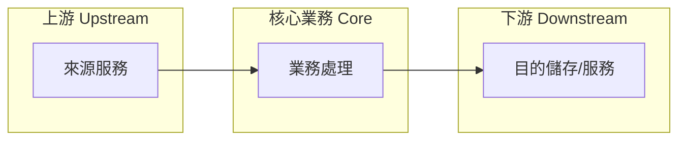

# README.business.md 模板與規則

八個章節缺一不可。

## 模板 (Template)

````markdown
# <Project Name> — 業務分析 (Business Analysis)

## 業務目的 (Purpose)

<1-3 句：替誰、解決什麼問題、產生什麼業務價值>

## 常見業務操作 (Common Operations)

<以業務動詞描述使用者或排程實際觸發的動作（不是函數名清單）>

## 上下游服務 (Upstream / Downstream)

`上游 (Upstream):` 資料或請求來源（外部服務、資料庫、使用者輸入）
`本體 (Core):` 本系統的業務處理
`下游 (Downstream):` 輸出去向（寫入的儲存、呼叫的外部 API、通知對象）



## 狀態與流程 (Status / Flow)

<業務物件的生命週期狀態（如 `pending → processed → archived`），
以 Mermaid `stateDiagram-v2` 呈現；若無明確狀態機，改用 `flowchart TD`
描述主要業務流程。狀態名稱必須來自實際程式或文件，不可虛構。>

## 業務約束 (Constraints)

列出限制業務行為的規則，每條附上來源依據：

- 准入/品質門檻（如真實性驗證、來源數量要求）
- 去重/冪等規則
- 時效/保留政策 (retention)
- 額度、頻率、排程限制

## 風險偵測 (Risk Detection)

逐項檢查並回報「有/無/不適用」，不可整節省略：

| 風險類別            | 檢查重點                         |
| :------------------ | :------------------------------- |
| 身分/合規 (KYC/AML) | 是否處理身分、金流、需驗證的對象 |
| 隱私 (Privacy)      | 個資、對話紀錄是否外流至第三方   |
| 資料完整性          | 遺失、重複、競態造成的業務錯誤   |
| 依賴風險            | 上下游服務不可用時業務是否停擺   |

## 核心業務 (Core Business)

<直接產生主要價值的業務>

## 非核心業務 (Non-core Business)

<支撐核心業務成長的業務（匯出、清理、報表、初始化等），
每項需註明它如何幫助核心業務>
````

## 規則 (Rules)

- 八個業務章節缺一不可；查無資料的章節明寫「未偵測到 (Not detected)」
- 禁止技術實作細節進入 `README.business.md`：建置、部署、設定同步、套件清單都不屬於業務
- 圖表一律 Mermaid；Mermaid 邊線文字必須雙引號包覆（`A -->|"文字"| B`）
- 狀態與名詞必須有程式或文件依據，禁止虛構
