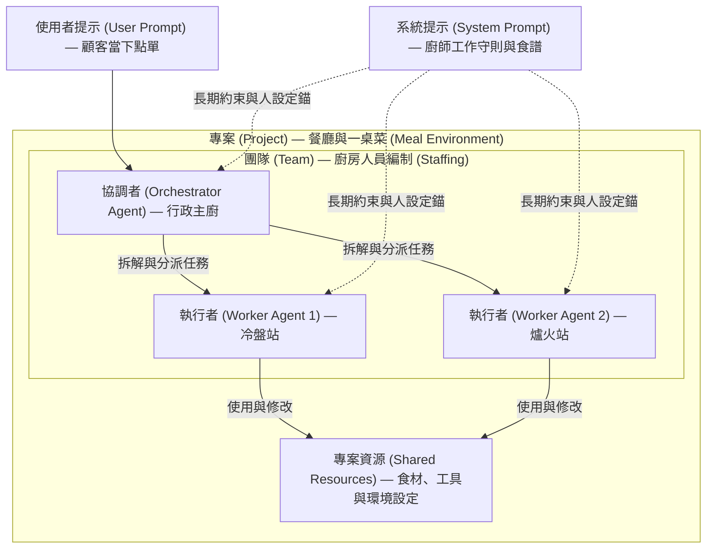

# AI 代理團隊規劃與設計插件 (AI Agent Team Planning & Design Plugin)

此插件提供了一套完整的 AI `代理團隊 (Agent Team)` 規劃與配置技能。其工作流可協助使用者從專案需求出發，規劃跨職能團隊的角色編制與主要職責，設計精確且具備大廠特質的 `系統提示 (System Prompt)`，並設定高效的編排與共享規則。

---

## 技能清單 (Skills List)

### 1. 團隊架構設計 (team-design)
- 路徑：`./skills/team-design`
- 用途：根據專案需求與交付目標，規劃跨職能團隊的角色編制、工作站位與主要職責。

### 2. 角色提示生成器 (role-generator)
- 路徑：`./skills/role-generator`
- 用途：依據五大原則（身分、職責、思考方式、格式、限制）設計與生成 `系統提示 (System Prompt)`，並可選融合 Meta、Google、Amazon 與 TikTok 等大廠的文化特質。

### 3. 團隊編排設定 (orchestration-config)
- 路徑：`./skills/orchestration-config`
- 用途：規劃 `協調者模式 (Orchestrator Pattern)` 或 `流水線模式 (Pipeline Pattern)` 的編排邏輯，並設定專案層級的共享規則。

---

## 工作流 (Workflow)

一整個 AI 代理團隊的設計與配置流程可以透過以下三個步驟串聯完成：

```
專案需求 (Project Requirements)
    │
    ▼ (team-design)
團隊架構與角色分工 (Team Architecture & Roles)
    │
    ▼ (role-generator)
角色提示詞與技能配置 (System Prompts & Skills)
    │
    ▼ (orchestration-config)
編排拓撲與專案層級設定 (Orchestration & Project-level Config)
```

1. 透過 `team-design` 釐清專案目標並定義所需站位。
2. 使用 `role-generator` 為每個站位產生符合 high-standard 人設定錨的 `系統提示 (System Prompt)`。
3. 透過 `orchestration-config` 定義代理間的溝通與流水線關係，並整理出專案層級的共享設定。

---

## 核心概念：以餐廳廚房理解架構 (Core Concepts: Kitchen Analogy)

將 `代理團隊 (Agent Team)` 協作比喻為一間餐廳的廚房運作：

- `專案 (Project)`：餐廳要出的 `一桌菜 (A meal)`。定義了最終目標、可用的食材（資料、檔案、工具）以及共享的環境設定。
- `團隊 (Team)`：整個廚房的 `人員編制 (Staffing)`，包含行政主廚與各站廚師。
- `角色 (Role)`：廚師的 `工作站位 (Station)`。每位廚師專注於單一任務（例如冷盤、爐火、擺盤），藉此穩定產出品質。
- `系統提示 (System Prompt)`：廚師手上的 `工作守則與食譜 (SOP & Recipe)`。定義了身分、職責範圍、品質標準以及限制，屬於長期固定的設定。
- `使用者提示 (User Prompt)`：顧客當下點的 `菜單指令 (Customer Order)`。屬於臨時、單次的任務指派。



### 關鍵差異 (Key Difference)
`系統提示 (System Prompt)` 是 `人設與規範 (Identity & Constraints)`，而 `使用者提示 (User Prompt)` 是 `當下任務 (Current Task)`。`系統提示 (System Prompt)` 會持續引導模型，對輸出風格與品質產生累積性的影響。

---

## 系統提示的定錨效應 (Anchoring Effect of System Prompts)

模型在生成文本時，其預測會受到上下文強烈引導。`系統提示 (System Prompt)` 作為優先權最高的上下文，能為模型進行 `定錨 (Anchoring)`，縮小模型的預測概率空間，使其行為與輸出風格高度符合設定的角色人設。這就是為什麼高質量的系統提示詞是代理團隊穩定產出與協同工作的基石。

---

## 團隊編排模式 (Team Orchestration Patterns)

藉由適當的編排方式，可以將多個單一職責的代理串聯起來以解決複雜的任務。常見的模式包括：

### 1. 協調者模式 (Orchestrator Pattern)
`協調者代理 (Orchestrator Agent)` 負責拆解任務、分派工作給各個 `專業代理 (Specialist Agents)`，最後彙整輸出結果。適用於複雜且需要整體統籌的任務。

### 2. 流水線模式 (Pipeline / Sequential Pattern)
任務依序在代理之間傳遞（例如：資料抓取代理 -> 資料驗證代理 -> 分析代理）。適用於步驟明確且高度標準化的流程。

### 專案層級設定 (Project-Level Settings)
建議將編碼風格、術語表、輸出語言（例如：繁體中文）以及可用工具清單等 `共通規則 (Shared Rules)` 提取至 `專案層級設定 (Project-level Settings)`，而各代理的 `系統提示 (System Prompt)` 僅保留其獨有的角色邏輯。這樣能大幅降低維護成本。

---

## 落地行動計畫 (Action Plan)

- `第一階段：定義成品目標 (Define Target Output)`：明確定義最終產出物的格式與驗收標準。
- `第二階段：拆解角色分工 (Define Roles & Stations)`：以分站思維拆解所需角色，維持單一職責原則（Single Responsibility Principle）。
- `第三階段：撰寫角色提示 (Write System Prompts)`：套用五大原則撰寫 `系統提示 (System Prompt)`，並將共通規則提取至專案層級。
- `第四階段：建立編排模式 (Orchestrate & Chain)`：根據流程複雜度選擇 Pipeline 或 Orchestrator 進行序列串接。
- `第五階段：真實任務迭代 (Iterative Optimization)`：藉由真實任務測試，每次僅調整單一代理的 Prompt，並建立測試案例進行迴歸測試。

---

## 大廠跨職能團隊範例 (Big Tech Cross-Functional Team)

_以 Meta / Google / Amazon / TikTok 等大廠跨職能產品團隊為藍本。_

- `使用方式 (How to use)`：將各角色的 Prompt 複製並貼入該 AI 代理的 `系統提示 (System Prompt)` 中。若欲指定輸出語言，可在尾端加上：`Always respond in Traditional Chinese, keeping technical terms in English.`
- `編排模式 (Team Pattern)`：`產品經理 (Product Manager / PM)` + `工程主管 (Engineering Manager)` = `協調者 (Orchestrators)`；其他專家角色為 `執行者 (Workers)`。設計師 -> 工程師 -> QA -> SRE 構成基本的 `流水線 (Pipeline)` 關係。
- `技能分類 (Skill Legend)`：各角色皆包含 `核心技術技能 (Core Technical Skills)` 與 `跨職能技能 (Cross-Functional Skills)`。在高階 (Senior) 代理的評估中，跨職能技能通常更為關鍵。

### 角色定位與檔案連結 (Role Definitions and Links)

| #   | 角色 (Role)                                        | 一句話定位 (One-sentence Description) | 檔案連結 (File Link)                                                                                                                   |
| --- | -------------------------------------------------- | ------------------------------------- | -------------------------------------------------------------------------------------------------------------------------------------- |
| 1   | 產品經理 (Product Manager / PM)                    | 定義「為什麼做、做什麼」              | [product_manager.md](./roles/product_manager.md)                                     |
| 2   | 工程主管 (Engineering Manager)                     | 拆解技術任務、做最終技術決策          | [engineering_manager.md](./roles/engineering_manager.md)                             |
| 3   | 後端工程師 (Backend Engineer)                      | 設計可擴展、容錯的伺服器邏輯          | [backend_engineer.md](./roles/backend_engineer.md)                                   |
| 4   | 前端工程師 (Frontend Engineer)                     | 介面效能與無障礙 (a11y)               | [frontend_engineer.md](./roles/frontend_engineer.md)                                 |
| 5   | 機器學習工程師 (Machine Learning Engineer / MLE)   | 把模型推到生產環境                    | [machine_learning_engineer.md](./roles/machine_learning_engineer.md)                 |
| 6   | 資料科學家 (Data Scientist)                        | A/B 實驗與因果分析                    | [data_scientist.md](./roles/data_scientist.md)                                       |
| 7   | 資料工程師 (Data Engineer)                         | 可靠的資料管線 (pipeline)             | [data_engineer.md](./roles/data_engineer.md)                                         |
| 8   | 產品設計師 (Product / UX Designer)                 | 以使用者需求設計流程                  | [product_designer.md](./roles/product_designer.md)                                   |
| 9   | 網站可靠性工程師 (Site Reliability Engineer / SRE) | SLO、監控、故障處理                   | [site_reliability_engineer.md](./roles/site_reliability_engineer.md)                 |
| 10  | 資安工程師 (Security Engineer)                     | 威脅建模與防禦                        | [security_engineer.md](./roles/security_engineer.md)                                 |
| 11  | 推薦系統工程師 (Recommendation Systems Engineer)   | 排序與個人化 (TikTok/Meta 招牌)       | [recommendation_systems_engineer.md](./roles/recommendation_systems_engineer.md)     |
| 12  | 成長分析師 (Growth / Product Analyst)              | 找出漏斗 (funnel) 缺口                | [growth_analyst.md](./roles/growth_analyst.md)                                       |

_提示：在多代理設定中，請將共享規則（輸出語言、公司術語、可用工具）置於專案層級，各提示詞僅攜帶角色特定內容。可將上述技能列表作為品質評估指標 — 若代理的輸出忽略了列出的某項技能（例如資料科學家遺漏了信賴區間），這表示應進一步優化其角色提示。_
