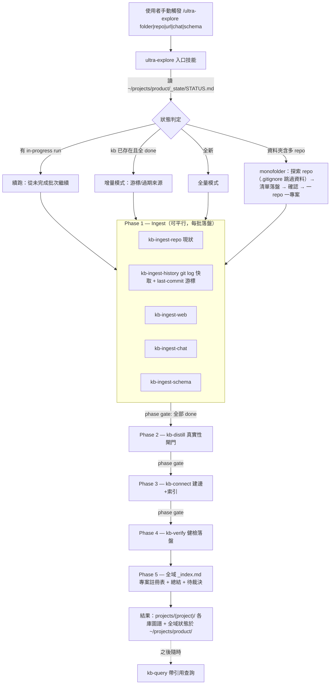

# Ultra-Explore — 知識庫建構插件 (Knowledge Base Construction Plugin)

從多來源建構一座可驗證、可增量更新、可續跑的知識庫。目標規模：
1000+ 檔案的 codebase 與 10000+ 份文件 — 因此每一步的結果都持久化在
`_state/`，任何中斷都能從最後一批續跑，任何模型（含較低階模型）
讀狀態檔即可接手。

整個插件只有一個入口：`/ultra-explore`。所有子技能
`disable-model-invocation: true`，模型不會在一般任務中自主觸發 —
只由入口技能驅動，或由使用者逐一手動呼叫。

## 觸發到結果 (Trigger → Result Flow)



## 設計原則 (Design Principles)

- `單一手動入口`：只有 `/ultra-explore` 可啟動全管道；子技能不受模型自主觸發
- `Monofolder 掃描`：一次觸發遍歷資料夾下所有 git repo；上層 `.gitignore`
  命中的資料目錄與 submodule 跳過，repo 內部靠 `git ls-files` 天然遵循
  各自的 `.gitignore`
- `狀態集中、知識分庫`：設計狀態輸出 `~/projects/product/`（`_state/` +
  全域 `_index.md`）；各 repo 知識輸出 `~/projects/product/projects/<project>/`
- `兩層儲存`：raw captures（`_inbox/`）與 curated entities（zone 資料夾）分離；
  品質閘門在兩層之間
- `真實性分級 (Truth Tiers)`：`confirmed` > `firsthand` > `corroborated` >
  `candidate`；candidate 永不進 curated 區
- `指紋去重 (Fingerprint Dedup)`：`sha256(正規化文本)`；異來源命中同指紋
  即 corroboration 訊號
- `游標增量 (Cursor)`：git log 快取只追加，`last-commit` 游標讓後續更新
  只處理新 commit
- `證據先於邊 (Evidence before Edges)`：內建 `topology-builder` 提供
  邊規則，每條邊必附發起方來源佐證
- `每批落盤 (Persist per Batch)`：先寫 manifest、每批更新 progress、
  續跑先讀狀態 — 三條鐵律寫在 `kb-spec`

## 技能清單 (Skills List)

| #   | 技能 (Skill)        | 用途                                                     | 觸發     |
| --- | ------------------- | -------------------------------------------------------- | -------- |
| 0   | `ultra-explore`     | 唯一全管道入口：解析來源 → 五階段 → 報告                 | 僅手動   |
| 1   | `kb-spec`           | 規範單一事實來源：儲存佈局、格式、truth、狀態追蹤        | 參考文件 |
| 2   | `kb-ingest-repo`    | git repo 現狀 → captures（每批 50 檔）                   | 僅手動   |
| 3   | `kb-ingest-history` | 內建 kb_history.py 管道（週 diff 佐證）+ 游標增量 → 開發史 captures + 回填 CHANGELOG.md | 僅手動   |
| 4   | `kb-ingest-web`     | URL → captures（markitdown/scrapling，每批 20 份）       | 僅手動   |
| 5   | `kb-ingest-chat`    | 對話 → 決策/事實/承諾/主張 captures（每批 200 則）       | 僅手動   |
| 6   | `kb-ingest-schema`  | RDB/KV/MQ/檔案結構 → captures（每批 30 物件）            | 僅手動   |
| 7   | `kb-distill`        | inbox → curated entities（身分歸併 + 真實性閘門）        | 僅手動   |
| 8   | `kb-connect`        | 建邊 + Backlinks 重算 + `_index.md` 重建                 | 僅手動   |
| 9   | `kb-verify`         | 健檢：斷鏈/佐證抽查/矛盾/過期，報告落盤                  | 僅手動   |
| 10  | `kb-query`          | 帶引用查詢，缺口記入 Frontier                            | 僅手動   |
| 11  | `topology-builder`  | 跨來源連結拓撲／知識圖譜構建                              | 自動觸發 |
| 12  | `changelog`         | git log 增量 → 結構化 commits.jsonl + CHANGELOG.md      | 僅手動 |

代理 (Agent)：`kb-coordinator` (`./agents/kb-coordinator.md`) — 由入口技能派工，phase gate 依 `_state/` 判定。

## 儲存佈局 (Storage Layout)

兩層結構（詳見 `kb-spec`）：狀態集中於全域根、知識依專案分庫：

```text
~/projects/product/            # 全域根：設計狀態集中輸出於此
├── _index.md                  # 跨專案總覽（專案註冊表 + 健康度）
├── _state/                    # STATUS.md 儀表板 + cache/（git log）+ runs/ 進度 + verify/ 報告
└── projects/<project>/        # 每個 repo 一個知識庫
    ├── _index.md              # 專案內註冊表 + Mermaid + Frontier + Unlinked
    ├── _inbox/                # raw captures（待蒸餾）
    ├── _sources/              # 來源登記（corroboration 計數 + last-commit 游標）
    └── <zone>/                # curated entities（wikilink 圖譜，不跨專案連結）
```

## 使用方式 (Usage)

```text
# monofolder：掃遍當前資料夾下所有 git repo（.gitignore 資料目錄自動跳過）
/ultra-explore .

# 全量建庫（唯一入口）
/ultra-explore <repo path/url> <url 清單> <對話匯出檔> <DDL 目錄>

# 之後增量更新：同一指令重跑即可 —
#   git 歷史走 last-commit 游標、過期來源重抓、raw captures 續蒸餾

# 單一技能手動呼叫（除錯或局部維護）
/kb-ingest-history <repo>     # 只更新開發史
/kb-verify                    # 只跑健檢
/kb-query <問題>              # 查詢
```

中斷後續跑：直接重下 `/ultra-explore` — 每個技能的 Step 0 會讀
`_state/runs/` 找到 in-progress run 並從未完成的批次繼續。

## 與既有插件的關係 (Relations)

- 格式相容 `topology-builder`（entity/wikilink/邊規則），另加 truth 標註與
  `supersedes` / `contradicts` 動詞
- 抓取複用 `explore` 插件的 `markitdown` / `scrapling` 工具鏈
- `general` 插件的 `changelog` 技能已在本插件內重新開發為
  `kb-ingest-history/scripts/kb_history.py`（單檔、純 stdlib、零安裝）：
  確定性管道產出 `_raw/commits.jsonl` + `stats.json` + `_diffs/*.diff` +
  `CHANGELOG.md` 骨架，蒸餾批次順手回填週敘事 — 不依賴原技能的 pip 套件
- `project-explore` / `business-extract` 仍負責單 repo 文件產出；
  本插件負責跨來源集中知識庫
